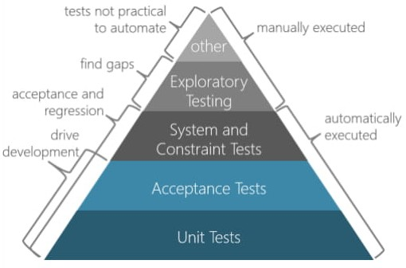
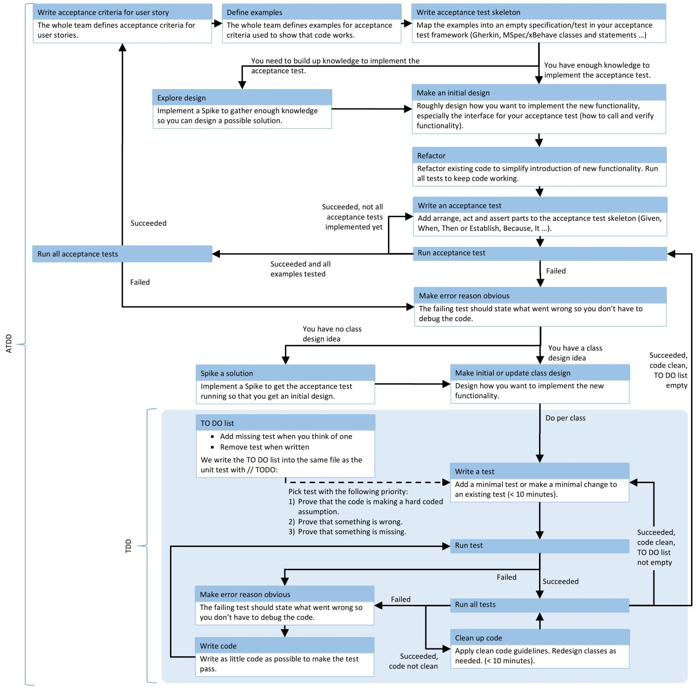

# Clean Code

## Why Clean Code
Code is clean if it can be understood easily – by everyone on the team. With
understandability comes readability, changeability, extensibility and
maintainability. All the things needed to keep a project going over a long
time without accumulating up a large amount of technical debt.

Technical Debt

Writing clean code from the start in a project is an investment in keeping
the cost of change as constant as possible throughout the lifecycle of a
software product. Therefore, the initial cost of change is a bit higher when
writing clean code (grey line) than quick and dirty programming (black line),
but is paid back quite soon. Especially if you keep in mind that most of the
cost has to be paid during maintenance of the software. Unclean code
results in technical debt that increases over time if not refactored into clean
code. There are other reasons leading to Technical Debt such as bad
processes and lack of documentation, but unclean code is a major driver. As
a result, your ability to respond to changes is reduced (red line).

### :large_blue_circle: In Clean Code, Bugs Cannot Hide

Most software defects are introduced when changing existing code. The
reason behind this is that the developer changing the code cannot fully
grasp the effects of the changes made. Clean code minimises the risk of
introducing defects by making the code as easy to understand as possible.

## Principles
### :large_blue_circle: Loose Coupling
Two classes, components or modules are coupled when at least one of
them uses the other. The less these items know about each other, the
looser they are coupled.

A component that is only loosely coupled to its environment can be more
easily changed or replaced than a strongly coupled component.

### :large_blue_circle: High Cohesion
Cohesion is the degree to which elements of a whole belong together.
Methods and fields in a single class and classes of a component should have
high cohesion. High cohesion in classes and components results in simpler,
more easily understandable code structure and design.

### :large_blue_circle: Change is Local
When a software system has to be maintained, extended and changed for a
long time, keeping change local reduces involved costs and risks. Keeping
change local means that there are boundaries in the design which changes
do not cross.

### :large_blue_circle: It is Easy to Remove
We normally build software by adding, extending or changing features.
However, removing elements is important so that the overall design can be
kept as simple as possible. When a block gets too complicated, it has to be
removed and replaced with one or more simpler blocks.

### :large_blue_circle: Mind-sized components
Break your system down into components that are of a size you can grasp
within your mind so that you can predict consequences of changes easily
(dependencies, control flow, …).

## Smells
### :red_circle: Rigidity
The software is difficult to change. A small change causes a cascade of
subsequent changes.

### :red_circle:  Fragility
The software breaks in many places due to a single change.

### :red_circle:  Immobility
You cannot reuse parts of the code in other projects because of involved
risks and high effort.

### :red_circle:  Viscosity of Design
Taking a shortcut and introducing technical debt requires less effort than
doing it right.

### :red_circle: ### Viscosity of Environment
Building, testing and other tasks take a long time. Therefore, these activities
are not executed properly by everyone and technical debt is introduced.

### :red_circle:  Needless Complexity
The design contains elements that are currently not useful. The added
complexity makes the code harder to comprehend. Therefore, extending
and changing the code results in higher effort than necessary.

### :red_circle:  Needless Repetition
Code contains exact code duplications or design duplicates (doing the same
thing in a different way). Making a change to a duplicated piece of code is
more expensive and more error-prone because the change has to be made
in several places with the risk that one place is not changed accordingly

### :red_circle:  Opacity
The code is hard to understand. Therefore, any change takes additional time
to first reengineer the code and is more likely to result in defects due to not
understanding the side effects.

## Class Design
### :large_blue_circle: Single Responsibility Principle (SRP)
A class should have one, and only one, reason to change.

### :large_blue_circle: Open Closed Principle (OCP)
You should be able to extend a classes behaviour without modifying it.

### :large_blue_circle: Liskov Substitution Principle (LSP)
Derived classes must be substitutable for their base classes.

### :large_blue_circle: Dependency Inversion Principle (DIP)
Depend on abstractions, not on concretions.

### :large_blue_circle: Interface Segregation Principle (ISP)
Make fine grained interfaces that are client-specific.

### :large_blue_circle: Classes Should be Small
Smaller classes are easier to grasp. Classes should be smaller than about
100 lines of code. Otherwise, it is hard to spot how the class does its job and
it probably does more than a single job.

### :large_blue_circle: Do stuff or know others, but not both
Classes should either do stuff (algorithm, read data, write data, …) or
orchestrate other classes. This reduces coupling and simplifies testing

## Package Cohesion
### :large_blue_circle: Release Reuse Equivalency Principle (RREP)
The granule of reuse is the granule of release.

### :large_blue_circle: Common Closure Principle (CCP)
Classes that change together are packaged together.

### Common Reuse Principle (CRP)
Classes that are used together are packaged together.

## Package Coupling
### :large_blue_circle: Acyclic Dependencies Principle (ADP)
The dependency graph of packages must have no cycles.

### :large_blue_circle: Stable Dependencies Principle (SDP)
Depend in the direction of stability.

### :large_blue_circle: Stable Abstractions Principle (SAP)
Abstractness increases with stability

## General
### :large_blue_circle: Follow Standard Conventions
Coding-, architecture-, design guidelines (check them with tools)

### :large_blue_circle: Keep it Simple, Stupid (KISS)
Simpler is always better. Reduce complexity as much as possible.

### :large_blue_circle: Boy Scout Rule
Leave the campground cleaner than you found it.

### :large_blue_circle: Root Cause Analysis
Always look for the root cause of a problem. Otherwise, it will get you again.

### :red_circle: Multiple Languages in One Source File
C#, Java, JavaScript, XML, HTML, XAML, English, German …

## Environment
### :large_blue_circle: Project Build Requires Only One Step
Check out and then build with a single command.

### :large_blue_circle: Executing Tests Requires Only One Step
Run all unit tests with a single command.

### :large_blue_circle: Source Control System
Always use a source control system.

### :large_blue_circle: Continuous Integration
Assure integrity with Continuous Integration

### :red_circle: Overridden Safeties
Do not override warnings, errors, exception handling – they will catch you.

## Dependency Injection
### :large_blue_circle: Decouple Construction from Runtime
Decoupling the construction phase completely from the runtime helps to
simplify the runtime behaviour.

## Design
### :large_blue_circle: Keep Configurable Data at High Levels
If you have a constant such as default or configuration value that is known
and expected at a high level of abstraction, do not bury it in a low-level
function. Expose it as an argument to the low-level function called from the
high-level function.

### :large_blue_circle: Don’t Be Arbitrary
Have a reason for the way you structure your code, and make sure that
reason is communicated by the structure of the code. If a structure appears
arbitrary, others will feel empowered to change it.

### :large_blue_circle: Be Precise
When you make a decision in your code, make sure you make it precisely.
Know why you have made it and how you will deal with any exceptions.

### :large_blue_circle: Structure over Convention
Enforce design decisions with structure over convention. Naming
conventions are good, but they are inferior to structures that force
compliance.

### :large_blue_circle: Prefer Polymorphism To If/Else or Switch/Case
“ONE SWITCH”: There may be no more than one switch statement for a
given type of selection. The cases in that switch statement must create
polymorphic objects that take the place of other such switch statements in
the rest of the system.

### :large_blue_circle: Symmetry / Analogy
Favour symmetric designs (e.g. Load – Save) and designs that follow
analogies (e.g. same design as found in .NET framework).

### :large_blue_circle: Separate Multi-Threading Code
Do not mix code that handles multi-threading aspects with the rest of the
code. Separate them into different classes.

### :red_circle: Misplaced Responsibility
Something put in the wrong place.

### :red_circle: Code at Wrong Level of Abstraction
Functionality is at wrong level of abstraction, e.g. a PercentageFull property
on a generic IStack<T>.

### :red_circle: Fields Not Defining State
Fields holding data that does not belong to the state of the instance but are
used to hold temporary data. Use local variables or extract to a class
abstracting the performed action.

### :red_circle: Over Configurability
Prevent configuration just for the sake of it – or because nobody can decide
how it should be. Otherwise, this will result in overly complex, unstable
systems

### :red_circle: Micro Layers
Do not add functionality on top, but simplify overall.

## Dependencies
### Make Logical Dependencies Physical +
### Singletons / Service Locator –
### Base Classes Depending On Their Derivatives –
### Too Much Information –
### Feature Envy –
### Artificial Coupling – 
### Hidden Temporal Coupling –
### Transitive Navigation –

## Naming
### Choose Descriptive / Unambiguous Names +
### Choose Names at Appropriate Level of Abstraction +
### Name Interfaces After Functionality They Abstract +
### Name Classes After How They Implement Interfaces +
### Name Methods After What They Do +
### Use Long Names for Long Scopes +
### Names Describe Side Effects +
### Standard Nomenclature Where Possible +
### Encodings in Names –

## Understandability
### Consistency +
### Use Explanatory Variables +
### Encapsulate Boundary Conditions +
### Prefer Dedicated Value Objects to Primitive Types +
### Poorly Written Comment –
### Obscured Intent –
### Obvious Behaviour Is Unimplemented –
### Hidden Logical Dependency –

## Methods
### Methods Should Do One Thing +
### Methods Should Descend 1 Level of Abstraction +
### Method with Too Many Arguments –
### Method with Out/Ref Arguments –
### Selector / Flag Arguments –
### Inappropriate Static –

## Source Code Structure
### Vertical Separation +
### Nesting
### Structure Code into Namespaces by Feature +

## Conditionals
### Encapsulate Conditionals +
### Positive Conditionals +

## Useless Stuff
### Dead Comment, Code –
### Clutter –
### Inappropriate Information –

## Maintainability Killers
### Duplication
### Magic Numbers / Strings –
### Enums (Persistent or Defining Behaviour) –
### Tangles

## Exception Handling
### Catch Specific Exceptions +
### Catch Where You Can React in a Meaningful Way +
### Use Exceptions instead of Return Codes or null +
### Fail Fast +
### Using Exceptions for Control Flow –
### Swallowing Exceptions –

## From Legacy Code to Clean Code
### Always have a Running System +
### 1) Identify Features +
### 2) Introduce Boundary Interfaces for Testability +
### 3) Write Feature Acceptance Tests +
### 4) Identify Components +
### 5) Refactor Interfaces between Components +
### 6) Write Component Acceptance Tests +
### 7) Decide for Each Component: 
### Refactor, Reengineer, Keep +
### 8a) Refactor Component +
### 8b) Reengineer Component +
### 8c) Keep Component +

## Refactoring Patterns
### Reconcile Differences – Unify Similar Code +
### Isolate Change +
### Migrate Data +
### Temporary Parallel Implementation +
### Demilitarized Zone for Components +
### Refactor before adding Functionality
### Small Refactorings

## How to Learn Clean Code
### Pair Programming +
### Commit Reviews +
### Coding Dojo +

## Kinds of Automated Tests
### ATDD – Acceptance Test Driven Development +
### TDD – Test Driven Development +
### DDT – Defect Driven Testing +
### POUTing – Plain Old Unit Testing +

## Design for Testability
### Constructor – Simplicity +
### Constructor – Lifetime +
### Abstraction Layers at System Boundary +

## Structure
### Arrange – Act – Assert +
### Test Assemblies (.Net) +
### Test Namespace +
### Unit Test Methods Show Whole Truth +
### SetUp / TearDown for Infrastructure Only +
### Test Method Naming +
### Resource Files +

## Naming
### Naming SUT Test Variables +
### Naming Result Values +
### Anonymous Variables +
### 

## Don’t Assume
### :large_blue_circle: Understand the Algorithm
- Just working is not enough, make sure you understand why it works.

### :red_circle: Incorrect Behaviour at Boundaries
- Always unit test boundaries. Do not assume behaviour. 

## Faking (Stubs, Fakes, Spies, Mocks, Test Doubles …)
### :large_blue_circle: Isolation from environment
- Use fakes to simulate all dependencies of the testee.

### :large_blue_circle: Faking Framework
- Use a dynamic fake framework for fakes that show different behaviour in different test scenarios (little behaviour reuse).

### :large_blue_circle: Manually Written Fakes
- Use manually written fakes when they can be used in several tests and they have only little changed behaviour in these scenarios (behaviour reuse).

### :red_circle: Mixing Stubbing and Expectation Declaration
- Make sure that you follow the AAA (arrange, act, assert) syntax when using fakes. Don’t mix setting up stubs (so that the testee can run) with expectations (on what the testee should do) in the same code block.

### :red_circle: Checking Fakes instead of Testee
- Tests that do not check the testee but values returned by fakes. Normally due to excessive fake usage.

### :red_circle: Excessive Fake Usage
- If your test needs a lot of fakes or fake setup, then consider splitting the testee into several classes or provide an additional abstraction between your testee and its dependencies.

## Unit Test Principles
### :large_blue_circle: Fast
Unit tests have to be fast in order to be executed often. Fast means much smaller than seconds.

### :large_blue_circle: Isolated
- Isolated testee: Clear where the failure happened.
- Isolated test: No dependency between tests (random order).

### :large_blue_circle: Repeatable
No assumed initial state, nothing left behind, no dependency on external
services that might be unavailable (databases, file system …).

### :large_blue_circle: Self-Validating
- No manual test interpretation or intervention. Red or green!

### :large_blue_circle: Timely
- Tests are written at the right time (TDD, DDT, POUTing)

## Unit Test Smells
### :red_circle: Test Not Testing Anything
Passing test that at first sight appears valid but does not test the testee.

### :red_circle: Test Needing Excessive Setup
A test that needs dozens of lines of code to set up its environment. This noise makes it difficult to see what is really tested.

### :red_circle: Too Large Test / Assertions for Multiple Scenarios
A valid test that is, however, too large. Reasons can be that this test checks for more than one feature or the testee does more than one thing (violation of Single Responsibility Principle).

### :red_circle: Checking Internals
A test that accesses internals (private/protected members) of the testee directly (Reflection). This is a refactoring killer.

### :red_circle: Test Only Running on Developer’s Machine
A test that is dependent on the development environment and fails elsewhere. Use continuous integration to catch them as soon as possible.

### :red_circle: Test Checking More than Necessary
A test that checks more than it is dedicated to. The test fails whenever something changes that it checks unnecessarily. Especially probable when fakes are involved or checking for item order in unordered collections. 

### :red_circle: Irrelevant Information
Test contains information that is not relevant to understand it.

### :red_circle: Chatty Test
A test that fills the console with text – probably used once to manually check for something.

### :red_circle: Test Swallowing Exceptions
A test that catches exceptions and lets the test pass.

### :red_circle: Test Not Belonging in Host Test Fixture
A test that tests a completely different testee than all other tests in the fixture.

### :red_circle: Obsolete Test
A test that checks something no longer required in the system. May even prevent clean-up of production code because it is still referenced.

### :red_circle: Hidden Test Functionality
Test functionality hidden in either the SetUp method, base class or helper class. The test should be clear by looking at the test method only – no initialisation or asserts somewhere else.

### :red_circle: Bloated Construction
The construction of dependencies and arguments used in calls to testee makes test hardly readable. Extract to helper methods that can be reused.

### :red_circle: Unclear Fail Reason
Split test or use assertion messages.

### :red_circle: Conditional Test Logic
Tests should not have any conditional test logic because it’s hard to read.

### :red_circle: Test Logic in Production Code
Tests depend on special logic in production code.

### Erratic Test
Sometimes passes, sometimes fails due to left overs or environment.

## TDD Principles
### :large_blue_circle: A Test Checks One Feature
A test checks exactly one feature of the testee. That means that it tests all things included in this feature but not more. This includes probably more than one call to the testee. This way, the tests serve as samples and documentation of the usage of the testee.

### :large_blue_circle: Tiny Steps
Make tiny little steps. Add only a little code in test before writing the required production code. Then repeat. Add only one Assert per step.

### :large_blue_circle: Keep Tests Simple
Whenever a test gets complicated, check whether you can split the testee into several classes (Single Responsibility Principle)

### :large_blue_circle: Prefer State Verification to Behaviour Verification
Use behaviour verification only if there is no state to verify. Refactoring is easier due to less coupling to implementation.

### :large_blue_circle: Test Domain Specific Language
Use test DSLs to simplify reading tests: builders to create test data using fluent APIs, assertion helpers for concise assertions.

## TDD Process Smells
### :red_circle: Using Code Coverage as a Goal
Pick a test you are confident you can implement and which maximises learning effect (e.g. impact on design).

### :red_circle: No Green Bar in the last ~10 Minutes
Make small steps to get feedback as fast and frequent as possible.

### :red_circle: Not Running Test Before Writing Production Code
Only if the test fails, then new code is required. Additionally, if the test surprisingly does not fail then make sure the test is correct.

### :red_circle: Not Spending Enough Time on Refactoring
Refactoring is an investment in the future. Readability, changeability and extensibility will pay back.

### :red_circle: Skipping Something Too Easy to Test
Don’t assume, check it. If it is easy, then the test is even easier.

### :red_circle: Skipping Something Too Hard to Test
Make it simpler, otherwise bugs will hide in there and maintainability will suffer.

### :red_circle: Organising Tests around Methods, Not Behaviour
These tests are brittle and refactoring killers. Test complete “mini” use cases in a way which reflects how the feature will be used in the real world. Do not test setters and getters in isolation, test the scenario they are used in.

## Red Bar Patterns
### :large_blue_circle: One Step Test
Pick a test you are confident you can implement and which maximises learning effect (e.g. impact on design).

### :large_blue_circle: Partial Test
Write a test that does not fully check the required behaviour, but brings you a step closer to it. Then use Extend Test below.

### :large_blue_circle: Extend Test
Extend an existing test to better match real-world scenarios.

### :large_blue_circle: Another Test
If you think of new tests, then write them on the TO DO list and don’t lose focus on current test.

### :large_blue_circle: Learning Test
Write tests against external components to make sure they behave as expected.

## Green Bar Patterns
### :large_blue_circle: Fake It (‘Til You Make It)
Return a constant to get first test running. Refactor later.

### :large_blue_circle: Triangulate – Drive Abstraction
Write test with at least two sets of sample data. Abstract implementation on these.

### :large_blue_circle: Obvious Implementation
If the implementation is obvious then just implement it and see if test runs. If not, then step back and just get test running and refactor then.

### :large_blue_circle: One to Many – Drive Collection Operations
First, implement operation for a single element. Then, step to several elements (and no element).

## Acceptance Test Driven Development
### :large_blue_circle: Use Acceptance Tests to Drive Your TDD tests
Acceptance tests check for the required functionality. Let them guide your TDD.

### :large_blue_circle: User Feature Test
An acceptance test is a test for a complete user feature from top to bottom that provides business value.

### :large_blue_circle: Automated ATDD
Use automated Acceptance Test Driven Development for regression testing and executable specifications.

### :large_blue_circle: Component Acceptance Tests
Write acceptance tests for individual components or subsystems so that these parts can be combined freely without losing test coverage.

### :large_blue_circle: Simulate System Boundaries
Simulate system boundaries like the user interface, databases, file system and external services to speed up your acceptance tests and to be able to check exceptional cases (e.g. a full hard disk). Use system tests to check the boundaries.

### :red_circle: Acceptance Test Spree
Do not write acceptance tests for every possibility. Write acceptance tests only for real scenarios. The exceptional and theoretical cases can be covered more easily with unit tests.

## Continuous Integration
### :large_blue_circle: Pre-Commit Check
Run all unit and acceptance tests covering currently worked on code prior to committing to the source code repository.

### :large_blue_circle: Post-Commit Check
Run all unit and acceptance tests on every commit to the version control system on the continuous integration server.

### :large_blue_circle: Communicate Failed Integration to Whole Team
Whenever a stage on the continuous integration server fails, notify whole team in order to get blocking situation resolved as soon as possible.

### :large_blue_circle: Build Staging
Split the complete continuous integration workflow into individual stages to reduce feedback time.

### :large_blue_circle: Automatically Build an Installer for Test System
Automatically build an installer as often as possible to test software on a test system (for manual tests, or tests with real hardware).

### :large_blue_circle: Continuous Deployment
Install the system to a test environment on every commit/push and on manual request. Deployment to production environment is automated to prevent manual mistakes, too.

## Test Pyramid

Constraint Test = Test for non-functional requirements.

## ATDD, TDD cycle

Acceptance Test-Driven Development

ATDD Cycle

ATDD Scheme

- Test Types
  - Unit Tests
    - Testing of individual functions or classes by supplying input and making sure the output is as expected.
  - Integration Tests
    - Testing processes or components to behave as expected, including the side effects.
  - UI Tests (A.K.A Functional Tests)
    - Testing scenarios on the product itself, by controlling the browser or the website, regardless of the internal structure to ensure expected behavior.

- Test Tools Types
  - Test launchers
  - Testing structure   
  - Assertions functions providers
  - Generate and display test progress and results.
  - Generate and compare snapshots of component and data structures to make sure changes from previous runs are intended
  - Provide mocks, spies, and stubs
  - Generate code coverage reports
  - Browser Controllers simulate user actions for Functional Tests. 
  - Visual Regression Tools are used to compare your site to its previous versions visually by using image comparison techniques.

- Redux Three Principles
  - Single source of truth
    - The state of your whole application is stored in an object tree within a single store.
  - State is read-only
    - The only way to change the state is to emit an action, an object describing what happened.
  - Changes are made with pure functions
    - To specify how the state tree is transformed by actions, you write pure reducers.

