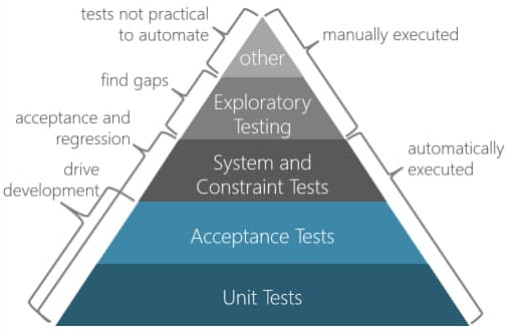
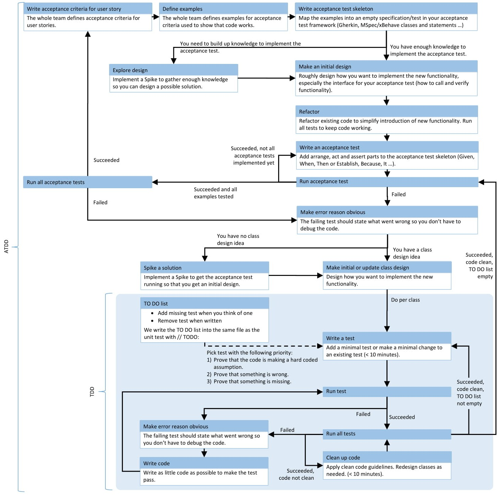

- Knowledgebase
  - Clean Architecture
    - Why is a clean, simple, flexible, evolvable, and agile architecture important?
      - Software architecture is the high level structure of a software system, the discipline of creating such structures, and the documentation of these structures.
      - It is the set of structures needed to reason about the software system, and comprises the software elements, the relations between them, and the properties of both elements and relations.
      - In today’s software development world, requirements change, environments change, team members change, technologies change, and so should the architecture of our systems.
      - The architecture defines the parts of a system that are hard and costly to change.
      - Therefore we are in need of a clean, simple, flexible, evolvable, and agile architecture to be able to keep up with all the changes surrounding us.
    - Clean architecture
      - An architecture that allows to replace details and is easy to verify.
      - Entities
        - Entities encapsulate enterprise-wide business rules. An entity can be an object with methods, or it can be a set of data structures and functions.
      - Use cases
        - Use cases orchestrate the flow of data to and from the entities, and direct those entities to use their enterprise-wide business rules to achieve the goals of the use cases.
      - Interface adapters
        - Adapters that convert data from the format most convenient for the use cases and entities, to the format most convenient for some external agency such as a database or the Web.
      - Frameworks and drivers
        - Glue code to connect UI, databases, devices etc. to the inner circles.
      - Program Flow
        - Starts on the outside and ends on the outside, but can go through several layers (user clicks a button, use case loads some entities from DB, entities decide something that is presented on the UI).
    - Architecture Principles
      - (+) Dependency management
        - This principle states that “High-level modules should not depend on low-level modules.
        - Both should depend on abstractions” and “Abstractions should not depend on details. Details should depend on abstractions”.
        - An inner layer should not know anything about upper/outer layers. As a result dependencies can only point inwards.
        - The concentric circles represent different areas of software. In general, the further in you go, the higher level the software becomes.
        - The outer circles are mechanisms. The inner circles are policies.
        - Source code dependencies can only point inwards. Nothing in an inner circle can know anything at all about something in an outer circle.
        - Use dependency inversion to build up the system (classes in an outer circle implement interfaces of an inner circle or listen to events from inner circles).
      - (+) Independent of frameworks. Independence from Details (UI, DB, transport protocol).
        - An architecture should not depend on frameworks, you should be able to swap a framework with the least effort.
        - This allows you to use such frameworks as tools, rather than having to cram your system into their technical constraints.
        - A software system’s core logic should not be affected by changes in UI, Databases, Frameworks, Libraries, etc.
      - (+) Testable
        - The business rules and use cases can be tested without UI, database, Web server, or any other external element.
      - (+) Entities and Use Cases.
        - Entities and use cases are the core of an application. And these layers should not be affected by changes in “detail layers”.
      - (+) The necessity of using adapters and converters.
        - Adapters and converters are used to convert models when they are propagating between layers to make them convenient to work with on a specific layer and do not spread extra dependencies to other layers.
      - (+) Independent of system boundaries (UI, database, …)
        - The UI, database, or any other external element can easily change without any impact on use cases and business rules.
      - (+) Passing data between boundaries.
        - You should always pay attention to objects being passed between layers. An object being passed should be isolated, simple or even just a plain data type without hidden dependencies.
        - You can encounter problems when you are using ORM (Object Relational Mapping) libraries and passing ORM objects outside the boundaries.
    - Simple architecture
      - An architecture that is easy to understand. Simplicity is, however, subjective.
      - (+) Consistent design decisions
        - One problem has one solution. Similar problems are solved similarly.
      - (+) Number of concepts/technologies
        - Simple solutions make use of only a few different concepts and technologies.
      - (+) Number of interactions
        - The less interactions the simpler the design.
        - A reasonable amount of components with only efferent coupling and most of the others with preferably only afferent coupling.
      - (+) Size
        - Small systems/components are easier to grasp than big ones. Build large systems out of small parts.
      - (+) Modularity
        - Build your system by connecting independent modules with a clearly defined interface (e.g. with adapters).
    - Flexible architecture
      - An architecture that supports change.
      - (+) Separation of concerns
        - Divide your system into distinct features with as little overlap in functionality as possible so that they can be combined freely
      - (+) Software reflects user’s mental model
        - When the structure and interactions inside the software match the user’s mental model, changes in the real world can more easily be applied in software.
      - (+) Abstraction
        - Separating ideas from specific implementations provides the flexibility to change the implementation. But beware of `over abstraction`.
      - (+) Interface slimness
        - Fat interfaces between components lead to strong coupling. Design the interfaces to be as slim as possible. But beware of `ambiguous interfaces`.
      - (+) Prefer composition over inheritance
        - Inheritance increases coupling between parent and child, thereby limiting reuse.
      - (+) Tangle-/cycle-free dependencies
        - The dependency graph of the elements of the architecture has no cycles, thus allowing locally bounded changes.
    - Evolvable architecture
      - An architecture that is easy to adapt step by step to keep up with changes.
      - (+) Matches current needs, not the future
        - The architecture of the current system should match the current needs (functional and non-functional) – not some future ones.
        - This results in simpler, easier to understand solutions. Otherwise, the risk of waste is very high.
      - (+) No dead-ends, architecture can be extended/adapted
        - The current architecture should be extendable and adaptable so that future needs can be addressed.
        - When evaluating different alternatives, choose one that is open for change.
      - (+) Architecture agnostic components
        - When components don’t care about which architecture they run in, the architecture can be changed without having to rewrite the components.
      - (+) Sacrificial architecture
        - When the software has outlived its architecture, throw the architecture away and start over.
        - This mindset can be used to build a first version with a very simple architecture, then start over for the next.
      - (+) Rolling refactoring
        - When a new version of a concept is introduced, then the old one is refactored out step by step.
        - There can be at most two versions of a concept in an application (and it should be temporary).
    - Agile architecture
      - An architecture that supports agile software development by enabling the principles of the Agile Manifesto
      - (+) Allow change quickly
        - The architecture allows quick changes through flexibility and evolvability.
      - (+) Verifiable at any time
        - The architecture can be verified (fulfils all quality aspects) at any time (e.g. every Sprint)
      - (+) Rapid deployment
        - The architecture supports continuous and rapid deployment so that stakeholders can give feedback continuously.
      - (+) Always working
        - The system is always working (probably with limited functionality) so that it is potentially shippable any time/at end of Sprint. Use assumptions, simplifications, simulators, shortcuts, hard-coding to build a walking skeleton.
    - Workflow
      - Use a top-down approach to find the architecture.
      - (+) Context
        - What belongs to your system and what does not? Which external services will you use?
      - (+) Break down into parts
        - Split the whole into parts by applying separation of concerns and the single responsibility principle.
      - (+) Communication
        - Which data flows through which call, message or event from one part to another? What are the properties of the channels (sync/async, reliability, …)
      - (+) Repeat for each part
        - Repeat the above-mentioned three steps for each part as if it were your system.
        - A part is a bounded context, subsystem or component.
    - Defer decisions
      - Decide only things you have enough knowledge about. Otherwise find a way to defer the decision and build up more knowledge. A good architecture allows you to defer most decisions.
      - (+) Abstraction
        - Use an abstraction to hide details so that you don’t have to decide about the details, but can use a simulation/fake at first to build up more knowledge.
      - (+) Simplification
        - Simplify the problem so that a decision can be made and work can progress. Use this to break free from a blocking state, but be aware of the risks a wrong decision could have.
      - (+) Wilful ignorance
        - Refuse to decide and wait until more knowledge about the problem and its potential solutions is built up.
      - (+) Decision delegation
        - Build the (part of a) system in a way that doesn’t require any decision, by making some other (part of the) system responsible that can be implemented later.
        - E.g. instead of deciding how to persist data, make the code calling your code responsible for passing all needed data to your code.
        - This allows you to build your whole business logic and decide about persistence when implementing the host that runs the business logic.
    - Architecture influencing forces
      - (+) Quality attributes
        - The needed quality attributes (functionality, reliability, usability, efficiency, maintainability, portability, …) are the primary drivers for architectural decisions.
      - (+) Team know-how and skills
        - The whole team understands and supports architecture and can make design decisions according to the architecture.
      - (+) Easiness of implementation
        - How easy an envisioned architecture can be implemented is a quality attribute.
      - (+) Cost of operations
        - Most costs of a software system accrue during operations, not implementation.
      - (+) Risks
        - Every technology, library, and design decision has its risks.
      - (+) Inherent opportunities
        - Things the architecture would allow us to do (but without investing any additional effort because we may never need it).
      - (+) Technology churn
        - Availability of new (better) technologies, resulting in a need for architecture change.
      - (+) Trade-offs
        - Designing an architecture comprises making trade-offs between conflicting goals.
        - Trade-offs must reflect the priorities of quality attributes set by the stakeholders.
        - Trade-offs should be documented and communicated to all stakeholders.
    - Architecture degrading forces
      - (-) Architectural drift
        - Introduction of design decisions into a system’s actual architecture that are not included in, encompassed by, or implied by the planned architecture.
      - (-) Architectural erosion
        - Introduction of design decisions into a system’s actual architecture that violate its planned architecture.
    - Architecture killers
      - (-) Split brain
        - Different parts of the system claim ownership of the same data or their interpretation resulting in inconsistencies and difficult synchronisation.
      - (-) Coupling in space and time
        - E.g. shared code to remove duplication hinders independent advancements, a service that needs other services to be up and running.
        - An `initialise` method that has to be called prior to any other method on the class (better use constructor injection or a factory).
      - (-) Dead-end
        - A design decision that prevents further adaptability without a major refactoring or rewrite.
    - Priorities
      - (+) Simplicity before generality
        - Concrete implementations are easier to understand than generalised concepts.
      - (+) Hard-coded before configurable
        - Configurability leads to if/else constructs or polymorphism inside the code, resulting in more complicated code.
      - (+) Use before reuse
        - Don’t design for reuse before the code has never actually been used. This leads to overgeneralisation, inapt interfaces and increased complexity.
      - (+) Working before optimised
        - First, make it work, then optimise. Premature optimisation leads to more complex solutions or to local instead of global optimisations.
      - (+) Quality attributes before functional requirements
        - Use quality scenarios to guide your architectural decisions because most of the times, quality attributes have more impact than functional requirements.
      - (+) Combined small systems over building a single big system
        - Big systems are more complicated to comprehend than a combination of small systems. But beware of complexity hidden in the communication between the systems.
    - Principles
      - (+) The teams that code the system, design the system.
        - Teams themselves are empowered to define, develop, and deliver software, and they are held accountable for the results.
      - (+) Build the simplest architecture that can possibly work.
        - Simplicity leads to comprehensibility, changeability, low defect introduction.
      - (+) When in doubt, code it out.
        - Get real feedback from running code, then decide.
      - (+) They build it, they test it.
        - Testing is an integral part of building software, not an afterthought.
      - (+) System architecture is a role collaboration.
        - The whole team participates in architecture decisions.
      - (+) There is no monopoly on innovation.
        - Every team member has time to innovate (spikes, hackathons, pet project).
    - Tips and tricks
      - (+) Start with concepts, not with technologies.
        - Don’t think in technologies, think in concepts. Then choose technologies matching the concepts and adapt concepts to technological limitations.
      - (+) Think about your envisioned architecture, but also lay a way from here to there.
        - Break your architecture work into steps. Use assumptions and simplifications in early steps.
        - Always make sure that there is a path from the current architecture to the envisioned architecture.
      - (+) Most of the time, persistence is a secondary thought
        - You always have some data. But that is no reason to start your design with the database. Business logic and workflows are more important.
      - (+) Decouple from environment
        - Design everything so that it has to know nothing about its environment.
      - (+) Prototypes, proof of concepts, feasibility studies
        - Break risks and grow knowledge fast, then decide.
      - (+) Use architecture patterns as inspiration, not as solutions.
        - Architecture patterns are good examples of solutions to specific problems.
        - Use them to find solutions for your problems and do not apply them to your problems.
    - Architectural aspects
      - (+) Persistence
        - Form of data (document-based, relational, graph, key-value), backup, transactions, size of data, throughput, replication, availability, concurrency.
      - (+) Translation (UI and data)
        - Static (e.g. resources) vs. dynamic, switchable during implementation/installation/start-up/runtime.
      - (+) Communication between parts
        - Asynchronous/synchronous, un-/reliable, latency, throughput, availability of connection, method calls/events/messages.
      - (+) Scaling
        - Run on multiple threads/processes/machines, availability, consistency, redundancy.
      - (+) Security
        - Authentication, authorisation, threats, encryption (of communication and data).
      - (+) Journaling, auditing
        - Operations, granularity, access to journal, tampering, regulatory.
      - (+) Reporting
        - Access to data (production/dedicated database/data warehouse), delivery mechanism (synchronous/asynchronous), formats (Web, PDF, …).
      - (+) Data migration, data import
        - Available time frame for migration/import, data quality, default values for missing values, value merging/splitting.
      - (+) Releasability
        - Release as one, per service or per component (e.g. plug-in). Automatic or manual release.
      - (+) Versioning
        - One product vs. a product family, technical/marketing version, manually or automatically generated, releases/service packs/hot fixes, SemVer.
      - (+) Backward compatibility
        - APIs, data (input/output/persisted), environment (e.g. old OS).
      - (+) Response times
        - Service time (actually performing the work) + wait time + transmission time.
      - (+) Archiving data
        - Data growth rate, access to archived data, split relations in relational data.
      - (+) Distribution
        - Beware of the fallacies of distributed computing: the network is reliable, latency is zero, bandwidth is infinite, the network is secure, topology doesn’t change, there is one administrator, transport cost is zero, the network is homogeneous.
      - (+) Public interfaces
        - Versioning, immutability and stability of contracts and schemas.
    - Documentation
      - (+) Questions to ask yourself
        - Who is the consumer? What do they need? How do you deliver the documentation to them? How do you know when they are ready for it? How do you produce it? What input do you need to produce it?
      - (+) Manual and automatic production
        - Manual
          - Someone writes the documentation, high risk of being out-of-date, very flexible.
        - Automatic
          - Generated from code, can be regenerated anytime and is therefore never out of date, finding right level of abstraction is hard. 
          - Works good for state machines, bootstrapping mechanics, and structural breakdown.
      - (+) About now, not the future
        - Only document what you did, not what you want to do.
      - (+) Shared
        - The whole team participates in producing the documentation.
    - Architecture smells
      - Causes: applying a design solution in an inappropriate context, mixing design fragments that have undesirable emergent behaviours.
      - (-) Overlayered architecture
        - When there are layers on layers on layers on layers ... in your application.
        - Not providing abstraction, lots of boilerplate code.
      - (-) Overabstraction
        - Too abstract to be understandable. Concrete designs are easier to understand.
      - (-) Overconfigurability
        - Everything is configurable because no decisions were made how the software should behave.
      - (-) Overkill Architecture
        - A simple problem with a complex (however technically interesting) solution.
      - (-) Futuristic Architecture
        - The architecture wants to anticipate a lot of future possible changes. This adds complexity and most likely also waste.
      - (-) Technology enthusiastic Architecture
        - Lots of new cool technology is introduced just for the sake of it.
      - (-) Paper tiger architecture
        - The architecture exists only on paper (UML diagrams) with no connection to the reality.
      - (-) Connector Envy
        -  Components with Connector Envy encompass extensive interaction-related functionality that should be delegated to a connector.
        - A component doing the job that should be delegated to a connector
          - communication (transfer of data)
          - coordination (transfer of control)
          - conversion (bridge different data formats, types, protocols)
          - facilitation (load-balancing, monitoring, fault tolerance)
      - (-) Component Envy
        - Connectors with Component Envy encompass extensive applicationspecific functionality that should be performed by a component.
      - (-) Concern overload
        - Indicates that a component implements an excessive number of concerns.
      - (-) Link Overload 
        - Dependency-based smell that occurs when a component has interfaces involved in an excessive number of links (i.e., dependencies on other components), affecting the system’s separation of concerns and effective isolation of changes.
        - A component may have an excessive number of incoming links, outgoing links, or both.
      - (-) Unused Interface.
        - A brick’s interface is unused if that interface is not used by another brick.
      - (-) Duplicate Component Functionality.
        - A component has duplicated functionality if it shares the same functionality as another component.
      - (-) Scattered parasitic functionality
        - Concern-based architectural smell.
        - It describes a system in which multiple components are responsible for realizing the same high-level concern while some of those components are also responsible for additional, orthogonal concerns.
        - Such an orthogonal concern “infects” a component, akin to a parasite.
        - A single concern is scattered across multiple components and at least one component addresses multiple orthogonal concerns.
      - (-) Ambiguous interfaces
        - Interfaces or meta-interfaces that offer only a single, general entry-point to a component or connector (e.g. pass an object, or general purpose events over an event bus); contain a single parameter; and dispatch to different internal operations based on the content of the parameter.
        - They are not explorable.
      - (-) Extraneous Adjacent Connector
        - Occurs when two connectors of different types are used to link a pair of components.
        - Two connectors of different types are used to link a pair of components.
        - E.g. event (asynchronous) and service call (synchronous).
          - Event: loosely coupled -> availability, replicability.
          - Method call: easy to understand.
          - Both: neither.
      - Dependency cycle indicates a set of components whose links form a circular chain, causing changes to one component to possibly affect all other components in the cycle.
      - Unused Brick. A brick is unused if its interfaces are all unused interfaces.
      - Connector Dimension Overload.
        - Occurs when a connector or set of linked connectors contains an excessive number of connector dimensions or sub-dimensions.
        - For example, a set of connectors that are linked and perform authentication, authorization, encryption, streaming, data access and distribution.
      - Lego Syndrome.
        - A brick suffers from Lego Syndrome when it handles an extremely small amount of functionality or a minor concern that is encompassed by a system concern.
        - This smell type represents bricks that are excessively small.
      - Sloppy Delegation.
        - Occurs when a component delegates to another component a small amount of functionality that it could have performed itself.
        - For example, a component that stores an aircraft’s current velocity, fuel level, and altitude and passes that data to another component that solely calculates that aircraft’s burn rate.
      - Brick Functionality Overload.
        - A brick that performs an excessive amount of functionality suffers from Brick Functionality Overload.
        - Note that the functionality performed by a brick is not necessarily mapped one-to-one to that brick’s concerns.
    - Networking Concepts
    - Networking Models
      - OSI Model
        - The Open Systems Interc­onn­ection model (OSI Model) is a conceptual model that charac­terizes and standa­rdizes the commun­ication functions of a teleco­mmu­nic­ation or computing system without regard of their underlying internal structure and techno­logy.
        - A layer serves the layer above it and is served by the layer below it.
        - Encapsulation
          - Preparing & passing the data by any Upper layer to the layer below it.
          - Going from the application layer all the way down to the physical layer.
        - Decapsulation
          - Decoding data while going Upwards from the physical layer till application layer.
        - Abstra­ction layers
          - Physical Layer
            - Transm­ission and reception of raw bit streams over a physical medium.
            - Specifies electrical, mechanical, procedural and functional requirements for activating, maintaining and deactivating a physical link.
          - Data Link Layer
            - Reliable transm­ission of data frames between two nodes connected by a physical layer.
            - Provides physical transmission of data, handles error notification, flow control and network topology. Split into two sub layers (LLC and MAC)
          - Network Layer
            - Struct­uring and managing a multi-node network, including addres­sing, routing and traffic control.
            - Manages logical addressing and path determination.
          - Transport Layer
            - Reliable transm­ission of data segments between points on a network, including segmen­tation, acknow­led­gement and multip­lexing.
            - Provides end-to-end transport services - establishes logical connections between hosts. Connection-oriented or connectionless data transfer.
          - Session Layer
            - Managing commun­ication sessions, i.e. continuous exchange of inform­ation in the form of multiple back-a­nd-­forth transm­issions between two nodes.
            - Setting up, managing and tearing down sessions. Keeps application’s data separate.
          - Presentation Layer
            - Transl­ation of data between a networking service and an applic­ation; including character encoding, data compre­ssion and encryp­tio­n/d­ecr­yption.
            -  Data translation, encryption, code formatting .
          - Application Layer
            - High-level APIs, including resource sharing, remote file access, directory services and virtual terminals.
            - Identifying and establishing the availability of intended communication partner and whether there are sufficient resources.
      - TCP/IP Model
        - TCP/IP provides end-to-end connec­tivity specifying how data should be packet­ized, addressed, transm­itted, routed and received at the destin­ation.
        - This functi­onality is organized into four abstra­ction layers which are used to sort all related protocols according to the scope of networking involved.
        - Abstra­ction layers
          - Network Access Layer
            - Specifies how data is physically sent through the network, including how bits are electr­ically signaled by hardware devices that interface directly with a network medium, such as: Coaxial cable, Optical fiber, Twiste­d-pair copper wire, Ethernet, RS-232
          - Internet Layer
            - Packages data into IP datagrams, containing source and destin­ation address inform­ation used to forward datagrams between hosts and across networks.
            - Protocols are: IP (Internet Protocol), ICMP (I­nternet Control Message Protocol), ARP (Address Resolution Protocol), RARP (Reverse Address Resolution Protocol)
          - Host-to-Host Layer
            - Provides commun­ication session management between computers. Defines the level of service and status of the connec­tio­n.
            - The main protocols included at Transport layer are: TCP (Trans­mission Control Protocol) and UDP (User Datagram Protocol).
          - Application Layer
            - Applic­ation layer includes all the higher­-level protocols:
              - Telnet - Terminal emulation program - port 23
              - TFTP - UDP file transfer - port 69
              - SMTP - Simple Mail Transfer Protocol - port 25
              - SSH - Secure Shell - port 22
              - FTP - TCP file transfer service - port 20-21
              - DNS - Domain Naming System – Resolves FQDNs to IP addresses – port 53
              - RDP - Remote Desktop Protocol
              - HTTP - Hypertext Transfer Protocol
              - DHCP - Dynamic Host Config­uration Protocol - Assigns IP addresses to hosts – ports 67 and 68
              - SNMP - Simple Network Management Protocol
    - Fallacies of distributed computing
      - The network is reliable.
        - Software applications are written with little error-handling on networking errors.
        - During a network outage, such applications may stall or infinitely wait for an answer packet, permanently consuming memory or other resources.
        - When the failed network becomes available, those applications may also fail to retry any stalled operations or require a (manual) restart.
      - Latency is zero.
        - Ignorance of network latency, and of the packet loss it can cause, induces application- and transport-layer developers to allow unbounded traffic, greatly increasing dropped packets and wasting bandwidth.
      - Bandwidth is infinite.
        - Ignorance of bandwidth limits on the part of traffic senders can result in bottlenecks.
      - The network is secure.
        - Complacency regarding network security results in being blindsided by malicious users and programs that continually adapt to security measures.[2]
      - Topology doesn't change.
        - Changes in network topology can have effects on both bandwidth and latency issues, and therefore can have similar problems.
      - There is one administrator.
        - Multiple administrators, as with subnets for rival companies, may institute conflicting policies of which senders of network traffic must be aware in order to complete their desired paths.
      - Transport cost is zero.
        - The "hidden" costs of building and maintaining a network or subnet are non-negligible and must consequently be noted in budgets to avoid vast shortfalls.
      - The network is homogeneous.
        - If a system assumes a homogeneous network, then it can lead to the same problems that result from the first three fallacies.
    - CAP theorem
      - Consistency
        - Every read receives the most recent write or an error.
      - Availability
        - Every request receives a (non-error) response – without the guarantee that it contains the most recent write.
      - Partition tolerance
        - The system continues to operate despite an arbitrary number of messages being dropped (or delayed) by the network between nodes.
    - Benefits of Serverless Architecture
      - Lower costs and scalability.
      - Faster development and deployment.
      - Reduced expenses on human resources.
      - High availability and auto-scaling.
      - Focus on business needs.
    - The Twelve Factors
      - Codebase
        - One codebase tracked in revision control, many deploys.
      - Dependencies
        - Explicitly declare and isolate dependencies.
      - Config
        - Store config in the environment.
      - Backing services
        - Treat backing services as attached resources.
      - Build, release, run
        - Strictly separate build and run stages.
      - Processes
        - Execute the app as one or more stateless processes.
      - Port binding
        - Export services via port binding.
      - Concurrency
        - Scale out via the process model.
      - Disposability
        - Maximize robustness with fast startup and graceful shutdown.
      - Dev/prod parity
        - Keep development, staging, and production as similar as possible.
      - Logs
        - Treat logs as event streams.
      - Admin processes
        - Run admin/management tasks as one-off processes.
    - Desirable qualities of a build process
      - Correct
        - never need to "clean" or wonder if build outputs are up-to-date
      - Fast
        - provides fast build execution
      - Parallelism
        - execute on multiple local or remote CPUs
      - Incremental
        - don't re-build everything from scratch
      - Deterministic
        - the output depends entirely on the inputs (predictability, caching)
      - Composable
        - allows reuse of existing build rules and creating new ones by combining them
      - Universal
        - Builds Android, iOS, web, backends, cloud services, and more
      - Multi-process
        - Isolation, allow more tool runtimes, defense against mem leaks
  - Clean Code
    - Why Clean Code
      - Code is clean if it can be understood easily – by everyone on the team.
      - With understandability comes readability, changeability, extensibility and maintainability.
      - All the things needed to keep a project going over a long time without accumulating up a large amount of technical debt.
      - Writing clean code from the start in a project is an investment in keeping the cost of change as constant as possible throughout the lifecycle of a software product.
      - Therefore, the initial cost of change is a bit higher when writing clean code than quick and dirty programming, but is paid back quite soon.
      - Especially if you keep in mind that most of the cost has to be paid during maintenance of the software.
      - Unclean code results in technical debt that increases over time if not refactored into clean code.
      - There are other reasons leading to Technical Debt such as bad processes and lack of documentation, but unclean code is a major driver.
      - As a result, your ability to respond to changes is reduced.
      - In Clean Code, Bugs Cannot Hide
        - Most software defects are introduced when changing existing code.
        - The reason behind this is that the developer changing the code cannot fully grasp the effects of the changes made.
        - Clean code minimises the risk of introducing defects by making the code as easy to understand as possible.
    - Principles
      - (+) Loose Coupling
        - Two classes, components or modules are coupled when at least one of them uses the other.
        - The less these items know about each other, the looser they are coupled.
        - A component that is only loosely coupled to its environment can be more easily changed or replaced than a strongly coupled component.
      - (+) High Cohesion
         - Cohesion is the degree to which elements of a whole belong together.
         - Methods and fields in a single class and classes of a component should have high cohesion.
         - High cohesion in classes and components results in simpler, more easily understandable code structure and design.
      - (+) Change is Local
        - When a software system has to be maintained, extended and changed for a long time, keeping change local reduces involved costs and risks.
        - Keeping change local means that there are boundaries in the design which changes do not cross.
      - (+) It is Easy to Remove
        - We normally build software by adding, extending or changing features.
        - However, removing elements is important so that the overall design can be kept as simple as possible.
        - When a block gets too complicated, it has to be removed and replaced with one or more simpler blocks.
      - (+) Mind-sized Components
        - Break your system down into components that are of a size you can grasp within your mind so that you can predict consequences of changes easily (dependencies, control flow, …).
    - Smells
      - (-) Rigidity
        - The software is difficult to change. A small change causes a cascade of subsequent changes.
      - (-) Fragility
        - The software breaks in many places due to a single change.
      - (-) Immobility
        - You cannot reuse parts of the code in other projects because of involved risks and high effort.
      - (-) Viscosity of Design
        - Taking a shortcut and introducing technical debt requires less effort than doing it right.
      - (-) Viscosity of Environment
        - Building, testing and other tasks take a long time. Therefore, these activities are not executed properly by everyone and technical debt is introduced.
      - (-) Needless Complexity
        - The design contains elements that are currently not useful. The added complexity makes the code harder to comprehend. Therefore, extending and changing the code results in higher effort than necessary.
      - (-) Needless Repetition
        - Code contains exact code duplications or design duplicates (doing the same thing in a different way).
        - Making a change to a duplicated piece of code is more expensive and more error-prone because the change has to be made in several places with the risk that one place is not changed accordingly.
      - (-) Opacity
        - The code is hard to understand. Therefore, any change takes additional time to first reengineer the code and is more likely to result in defects due to not understanding the side effects.
    - Class Design
      - (+) Single Responsibility Principle (SRP)
        - A class should have one, and only one, reason to change.
      - (+) Open Closed Principle (OCP)
        - You should be able to extend a classes behaviour without modifying it.
      - (+) Liskov Substitution Principle (LSP)
        - Derived classes must be substitutable for their base classes.
      - (+) Dependency Inversion Principle (DIP)
        - Depend on abstractions, not on concretions.
      - (+) Interface Segregation Principle (ISP)
        - Make fine grained interfaces that are client-specific.
      - (+) Classes Should be Small
        - Smaller classes are easier to grasp. Classes should be smaller than about 100 lines of code. Otherwise, it is hard to spot how the class does its job and it probably does more than a single job.
      - (+) Do stuff or know others, but not both
        - Classes should either do stuff (algorithm, read data, write data, …) or orchestrate other classes. This reduces coupling and simplifies testing
    - Package Cohesion
      - (+) Release Reuse Equivalency Principle (RREP)
        - The granule of reuse is the granule of release.
      - (+) Common Closure Principle (CCP)
        - Classes that change together are packaged together.
      - (+) Common Reuse Principle (CRP)
        - Classes that are used together are packaged together.
    - Package Coupling
      - (+) Acyclic Dependencies Principle (ADP)
        - The dependency graph of packages must have no cycles.
      - (+) Stable Dependencies Principle (SDP)
        - Depend in the direction of stability.
      - (+) Stable Abstractions Principle (SAP)
        - Abstractness increases with stability.
    - General
      - (+) Follow Standard Conventions
        - Coding-, architecture-, design guidelines (check them with tools)
      - (+) Keep it Simple, Stupid (KISS)
        - Simpler is always better. Reduce complexity as much as possible.
      - (+) Boy Scout Rule
        - Leave the campground cleaner than you found it.
      - (+) Root Cause Analysis
        - Always look for the root cause of a problem. Otherwise, it will get you again.
      - (-) Multiple Languages in One Source File
        - C#, Java, JavaScript, XML, HTML, XAML, English, German …
    - Environment
      - (+) Project Build Requires Only One Step
        - Check out and then build with a single command.
      - (+) Executing Tests Requires Only One Step
        - Run all unit tests with a single command.
      - (+) Source Control System
        - Always use a source control system.
      - (+) Continuous Integration
        - Assure integrity with Continuous Integration
      - (-) Overridden Safeties
        - Do not override warnings, errors, exception handling – they will catch you.
    - Dependency Injection
      - (+) Decouple Construction from Runtime
        - Decoupling the construction phase completely from the runtime helps to simplify the runtime behaviour.
    - Design
      - (+) Keep Configurable Data at High Levels
        - If you have a constant such as default or configuration value that is known and expected at a high level of abstraction, do not bury it in a low-level function.
        - Expose it as an argument to the low-level function called from the high-level function.
      - (+) Don’t Be Arbitrary
        - Have a reason for the way you structure your code, and make sure that reason is communicated by the structure of the code.
        - If a structure appears arbitrary, others will feel empowered to change it.
      - (+) Be Precise
        - When you make a decision in your code, make sure you make it precisely.
        - Know why you have made it and how you will deal with any exceptions.
      - (+) Structure over Convention
        - Enforce design decisions with structure over convention.
        - Naming conventions are good, but they are inferior to structures that force compliance.
      - (+) Prefer Polymorphism To If/Else or Switch/Case
        - “ONE SWITCH”: There may be no more than one switch statement for a given type of selection.
        - The cases in that switch statement must create polymorphic objects that take the place of other such switch statements in the rest of the system.
      - (+) Symmetry / Analogy
        - Favour symmetric designs (e.g. Load – Save) and designs that follow analogies (e.g. same design as found in .NET framework).
      - (+) Separate Multi-Threading Code
        - Do not mix code that handles multi-threading aspects with the rest of the code. Separate them into different classes
      - (-) Misplaced Responsibility
        - Something put in the wrong place.
      - (-) Code at Wrong Level of Abstraction
        - Functionality is at wrong level of abstraction, e.g. a PercentageFull property on a generic IStack<T>.
      - (-) Fields Not Defining State
        - Fields holding data that does not belong to the state of the instance but are used to hold temporary data. Use local variables or extract to a class abstracting the performed action.
      - (-) Over Configurability
        - Prevent configuration just for the sake of it – or because nobody can decide how it should be. Otherwise, this will result in overly complex, unstable systems.
      - (-) Micro Layers
        - Do not add functionality on top, but simplify overall.
    - Dependencies
      - (+) Make Logical Dependencies Physical
        - If one module depends upon another, that dependency should be physical, not just logical. Don’t make assumptions.
      - (-) Singletons / Service Locator
         - Use dependency injection. Singletons hide dependencies.
      - (-) Base Classes Depending On Their Derivatives
        - Base classes should work with any derived class.
      - (-) Too Much Information
        - Minimise interface to minimise coupling
      - (-) Feature Envy
        - The methods of a class should be interested in the variables and functions of the class they belong to, and not the variables and functions of other classes.
        - Using accessors and mutators of some other object to manipulate its data, is envying the scope of the other object.
      - (-) Artificial Coupling
        - Things that don’t depend upon each other should not be artificially coupled.
      - (-) Hidden Temporal Coupling
        - If, for example, the order of some method calls is important, then make sure that they cannot be called in the wrong order.
      - (-) Transitive Navigation
        - Aka Law of Demeter, writing shy code.
        - A module should know only its direct dependencies.
    - Naming
      - (+) Choose Descriptive / Unambiguous Names
        - Names have to reflect what a variable, field, property stands for. Names have to be precise.
      - (+) Choose Names at Appropriate Level of Abstraction
        - Choose names that reflect the level of abstraction of the class or method you are working in.
      - (+) Name Interfaces After Functionality They Abstract
        - The name of an interface should be derived from its usage by the client.
      - (+) Name Classes After How They Implement Interfaces
        - The name of a class should reflect how it fulfils the functionality provided by its interface(s), such as MemoryStream : IStream 
      - (+) Name Methods After What They Do
        - The name of a method should describe what is done, not how it is done.
      - (+) Use Long Names for Long Scopes
        - (long) fields -> parameters -> locals -> loop variables (short)
      - (+) Names Describe Side Effects
        - Names have to reflect the entire functionality.
      - (+) Standard Nomenclature Where Possible
        - Don’t invent your own language when there is a standard.
      - (-) Encodings in Names
        - No prefixes, no type/scope information
    - Understandability
      - (+) Consistency
        - If you do something a certain way, do all similar things in the same way: same variable name for same concepts, same naming pattern for corresponding concepts.
      - (+) Use Explanatory Variables
        - Use locals to give steps in algorithms names.
      - (+) Encapsulate Boundary Conditions
        - Boundary conditions are hard to keep track of. Put the processing for them in one place, e.g. nextLevel = level + 1;
      - (+) Prefer Dedicated Value Objects to Primitive Types
        - Instead of passing primitive types like strings and integers, use dedicated primitive types: e.g. AbsolutePath instead of string.
      - (-) Poorly Written Comment
        - Comment does not add any value (redundant to code), is not well formed, not correct grammar/spelling.
      - (-) Obscured Intent
        - Too dense algorithms that lose all expressiveness.
      - (-) Obvious Behaviour Is Unimplemented
        - Violations of “the Principle of Least Astonishment”. What you expect is what you get.
      - (-) Hidden Logical Dependency
        - A method can only work when invoked correctly depending on something else in the same class, e.g. a DeleteItem method must only be called if a CanDeleteItem method returned true, otherwise it will fail
    - Methods
      - (+) Methods Should Do One Thing
        - Loops, exception handling, … encapsulate in sub-methods.
      - (+) Methods Should Descend 1 Level of Abstraction
        - The statements within a method should all be written at the same level of abstraction, which should be one level below the operation described by the name of the function.
      - (-) Method with Too Many Arguments
        - Prefer fewer arguments. Maybe functionality can be outsourced to a dedicated class that holds the information in fields.
      - (-) Method with Out/Ref Arguments
        - Prevent usage. Return complex object holding all values, split into several methods. If your method must change the state of something, have it change the state of the object it is called on.
      - (-) Selector / Flag Arguments
        - public int Foo(bool flag)
        - Split method into several independent methods that can be called from the client without the flag.
      - (-) Inappropriate Static
        - Static method that should be an instance method
    - Source Code Structure
      - (+) Vertical Separation
        - Variables and methods should be defined close to where they are used.
        - Local variables should be declared just above their first usage and should have a small vertical scope.
      - (+) Nesting
        - Nested code should be more specific or handle less probable scenarios than unnested code.
      - (+) Structure Code into Namespaces by Feature
        - Keep everything belonging to the same feature together. Don't use namespaces communicating layers. A feature may use another feature; a business feature may use a core feature like logging.
    - Conditionals
      - (+) Encapsulate Conditionals
        - if (this.ShouldBeDeleted(timer)) is preferable to if (timer.HasExpired && !timer.IsRecurrent)
      - (+) Positive Conditionals
        - Positive conditionals are easier to read than negative conditionals.
    - Useless Stuff
      - Dead Comment, Code
        - (-) Delete unused things. You can find them in your version control system.
      - Clutter
        - (-) Code that is not dead but does not add any functionality
      - Inappropriate Information
        - (-) Comment holding information better held in a different system: product backlog, source control. Use code comments for technical notes only.
    - Maintainability Killers
      - (+) Duplication
        - Eliminate duplication. Violation of the “Don’t repeat yourself” (DRY) principle.
      - (+) Magic Numbers / Strings
        - Replace Magic Numbers and Strings with named constants to give them a meaningful name when meaning cannot be derived from the value itself
      - (+) Enums (Persistent or Defining Behaviour)
        - Use reference codes instead of enums if they have to be persisted. Use polymorphism instead of enums if they define behaviour.
      - (+) Tangles
        - The class dependencies should not be tangled. There should be no cyclic dependency chains. In a cycle there is no point to start changing the code without side-effects.
    - Exception Handling
      - (+) Catch Specific Exceptions
        - Catch exceptions as specific as possible. Catch only the exceptions for which you can react in a meaningful manner.
      - (+) Catch Where You Can React in a Meaningful Way
        - Only catch exceptions when you can react in a meaningful way. Otherwise, let someone up in the call stack react to it.
      - (+) Use Exceptions instead of Return Codes or null
        - In an exceptional case, throw an exception when your method cannot do its job. Don't accept or return null. Don't return error codes.
      - (+) Fail Fast
        - Exceptions should be thrown as early as possible after detecting an exceptional case. This helps to pinpoint the exact location of the problem by looking at the stack trace of the exception.
      - (-) Using Exceptions for Control Flow
        - Using exceptions for control flow: has bad performance, is hard to understand and results in very hard handling of real exceptional cases.
      - (-) Swallowing Exceptions
        - Exceptions can be swallowed only if the exceptional case is completely resolved after leaving the catch block. Otherwise, the system is left in an inconsistent state.
    - From Legacy Code to Clean Code
      - (+) Always have a Running System
        - Change your system in small steps, from a running state to a running state. 
      - (+) Identify Features
        - Identify the existing features in your code and prioritise them according to how relevant they are for future development (likelihood and risk of change).
      - (+) Introduce Boundary Interfaces for Testability
        - Refactor the boundaries of your system to interfaces so that you can simulate the environment with test doubles (fakes, mocks, stubs).
      - (+) Write Feature Acceptance Tests
        - Cover a feature with Acceptance Tests to establish a safety net for refactoring.
      - (+) Identify Components
        - Within a feature, identify the components used to provide the feature.
        - Prioritise components according to relevance for future development (likelihood and risk of change).
      - (+) Refactor Interfaces between Components
        - Refactor (or introduce) interfaces between components so that each component can be tested in isolation of its environment.
      - (+) Write Component Acceptance Tests
        - Cover the features provided by a component with Acceptance Tests.
      - (+) Decide for Each Component: 
        - Refactor, Reengineer, Keep
        - Decide for each component whether to refactor, reengineer or keep it.
      - (+) Refactor Component
        - Redesign classes within the component and refactor step by step (see Refactoring Patters). Add unit tests for each newly designed class.
      - (+) Reengineer Component
        - Use ATDD and TDD (see Clean ATDD/TDD cheat sheet) to re-implement the component.
      - (+) Keep Component
        - If you anticipate only few future changes to a component and the component had few defects in the past, consider keeping it as it is.
    - Refactoring Patterns
      - (+) Reconcile Differences – Unify Similar Code
        - Change both pieces of code stepwise until they are identical. Then extract.
      - (+) Isolate Change
        - First, isolate the code to be refactored from the rest. Then refactor. Finally, undo isolation.
      - (+) Migrate Data
        - Move from one representation to another by temporary duplication of data structures.
      - (+) Temporary Parallel Implementation
        - Refactor by introducing a temporary parallel implementation of an algorithm. Switch one caller after the other. Remove old solution when no longer needed. This way you can refactor with only one red test at a time.
      - (+) Demilitarized Zone for Components
        - Introduce an internal component boundary and push everything unwanted outside of the internal boundary into the demilitarized zone between component interface and internal boundary. Then refactor the component interface to match the internal boundary and eliminate the demilitarized zone.
      - (+) Refactor before adding Functionality
        - Refactor the existing code before adding new functionality in a way so that the change can easily be made.
      - (+) Small Refactorings
        - Only refactor in small steps with working code in-between so that you can keep all loose ends in your head. Otherwise, defects sneak in.
    - How to Learn Clean Code
      - (+) Pair Programming
        - Two developers solving a problem together at a single workstation. One is the driver, the other is the navigator. The driver is responsible for writing the code. The navigator is responsible for keeping the solution aligned with the architecture, the coding guidelines and looks at where to go next (e.g. which test to write next). Both challenge their ideas and approaches to solutions.
      - (+) Commit Reviews
        - A developer walks a peer developer through all code changes prior to committing (or pushing) the changes to the version control system. The peer developer checks the code against clean code guidelines and design guidelines.
      - (+) Coding Dojo
        - In a Coding Dojo, a group of developers come together to exercise their skills. Two developers solve a problem (kata) in pair programming. The rest observe. After 10 minutes, the group rotates to build a new pair. The observers may critique the current solution, but only when all tests are green.
    - Kinds of Automated Tests
      - ATDD – Acceptance Test Driven Development
        - Specify a feature first with a test, then implement.
      - TDD – Test Driven Development
        - Red – green – refactor. Test a little – code a little.
      - DDT – Defect Driven Testing
        - Write a unit test that reproduces the defect – Fix code – Test will succeed – Defect will never return.
      - POUTing – Plain Old Unit Testing
        - Aka test after. Write unit tests to check existing code. You cannot and probably do not want to test drive everything. Use POUT to increase sanity. Use to add additional tests after TDDing (e.g. boundary cases).
    - Design for Testability
      - Constructor – Simplicity
        - Objects have to be easily creatable. Otherwise, easy and fast testing is not possible.
      - Constructor – Lifetime
        - Pass dependencies and configuration/parameters into the constructor that have a lifetime equal to or longer than the created object. For other values use methods or properties
      - Abstraction Layers at System Boundary
        - Use abstraction layers at system boundaries (database, file system, web services, ...) that simplify unit testing by enabling the usage of fakes.
    - Structure
      - Arrange – Act – Assert
        - Structure the tests always by AAA. Never mix these three blocks.
      - Test Assemblies (.Net)
        - Create a test assembly for each production assembly and name it as the production assembly + “.Test”/”.Facts”/… .
      - Test Namespace
        - Put the tests in the same namespace as their associated testee.
      - Unit Test Methods Show Whole Truth
        - Unit test methods show all parts needed for the test. Do not use SetUp method or base classes to perform actions on testee or dependencies.
      - SetUp / TearDown for Infrastructure Only
        - Use the SetUp / TearDown methods only for infrastructure that your unit test needs. Do not use it for anything that is under test.
      - Test Method Naming
        - Use a pattern that reflects behaviour of tested code, e.g. Behaviour[_OnTrigger][_WhenScenario] with [] as optional parts.
      - Resource Files 
        - Test and resource are together: FooTest.cs, FooTest.resx
    - Naming
      - Naming SUT Test Variables
        - Give the variable holding the System Under Test always the same name (e.g. testee or sut). Clearly identifies the SUT, robust against refactoring.
      - Naming Result Values
        - Give the variable holding the result of the tested method always the same name (e.g. result).
      - Anonymous Variables
        - Always use the same name for variables holding uninteresting arguments to tested methods (e.g. anonymousText, anyText).
    - Don’t Assume
      - (+) Understand the Algorithm
        - Just working is not enough, make sure you understand why it works.
      - (-) Incorrect Behaviour at Boundaries
        - Always unit test boundaries. Do not assume behaviour. 
    - Faking (Stubs, Fakes, Spies, Mocks, Test Doubles …)
      - (+) Isolation from environment
        - Use fakes to simulate all dependencies of the testee.
      - (+) Faking Framework
        - Use a dynamic fake framework for fakes that show different behaviour in different test scenarios (little behaviour reuse).
      - (+) Manually Written Fakes
        - Use manually written fakes when they can be used in several tests and they have only little changed behaviour in these scenarios (behaviour reuse).
      - (-) Mixing Stubbing and Expectation Declaration
        - Make sure that you follow the AAA (arrange, act, assert) syntax when using fakes. Don’t mix setting up stubs (so that the testee can run) with expectations (on what the testee should do) in the same code block.
      - (-) Checking Fakes instead of Testee
        - Tests that do not check the testee but values returned by fakes. Normally due to excessive fake usage.
      - (-) Excessive Fake Usage
        - If your test needs a lot of fakes or fake setup, then consider splitting the testee into several classes or provide an additional abstraction between your testee and its dependencies.
    - Unit Test Principles
      - (+) Fast
        - Unit tests have to be fast in order to be executed often. Fast means much smaller than seconds.
      - (+) Isolated
        - Isolated testee: Clear where the failure happened.
        - Isolated test: No dependency between tests (random order).
      - (+) Repeatable
        - No assumed initial state, nothing left behind, no dependency on external services that might be unavailable (databases, file system …).
      - (+) Self-Validating
        - No manual test interpretation or intervention. Red or green!
      - (+) Timely
        - Tests are written at the right time (TDD, DDT, POUTing)
    - Unit Test Smells
      - (-) Test Not Testing Anything
        - Passing test that at first sight appears valid but does not test the testee.
      - (-) Test Needing Excessive Setup
        - A test that needs dozens of lines of code to set up its environment. This noise makes it difficult to see what is really tested.
      - (-) Too Large Test / Assertions for Multiple Scenarios
        - A valid test that is, however, too large. Reasons can be that this test checks for more than one feature or the testee does more than one thing (violation of Single Responsibility Principle).
      - (-) Checking Internals
        - A test that accesses internals (private/protected members) of the testee directly (Reflection). This is a refactoring killer.
      - (-) Test Only Running on Developer’s Machine
        - A test that is dependent on the development environment and fails elsewhere. Use continuous integration to catch them as soon as possible.
      - (-) Test Checking More than Necessary
        - A test that checks more than it is dedicated to. The test fails whenever something changes that it checks unnecessarily. Especially probable when fakes are involved or checking for item order in unordered collections. 
      - (-) Irrelevant Information
        - Test contains information that is not relevant to understand it.
      - (-) Chatty Test
        - A test that fills the console with text – probably used once to manually check for something.
      - (-) Test Swallowing Exceptions
        - A test that catches exceptions and lets the test pass.
      - (-) Test Not Belonging in Host Test Fixture
        - A test that tests a completely different testee than all other tests in the fixture.
      - (-) Obsolete Test
        - A test that checks something no longer required in the system. May even prevent clean-up of production code because it is still referenced.
      - (-) Hidden Test Functionality
        - Test functionality hidden in either the SetUp method, base class or helper class. The test should be clear by looking at the test method only – no initialisation or asserts somewhere else.
      - (-) Bloated Construction
        - The construction of dependencies and arguments used in calls to testee makes test hardly readable. Extract to helper methods that can be reused.
      - (-) Unclear Fail Reason
        - Split test or use assertion messages.
      - (-) Conditional Test Logic
        - Tests should not have any conditional test logic because it’s hard to read.
      - (-) Test Logic in Production Code
        - Tests depend on special logic in production code.
      - (-) Erratic Test
        - Sometimes passes, sometimes fails due to left overs or environment.
    - TDD Principles
      - (+) A Test Checks One Feature
        - A test checks exactly one feature of the testee. That means that it tests all things included in this feature but not more. This includes probably more than one call to the testee. This way, the tests serve as samples and documentation of the usage of the testee.
      - (+) Tiny Steps
        - Make tiny little steps. Add only a little code in test before writing the required production code. Then repeat. Add only one Assert per step.
      - (+) Keep Tests Simple
        - Whenever a test gets complicated, check whether you can split the testee into several classes (Single Responsibility Principle)
      - (+) Prefer State Verification to Behaviour Verification
        - Use behaviour verification only if there is no state to verify. Refactoring is easier due to less coupling to implementation.
      - (+) Test Domain Specific Language
        - Use test DSLs to simplify reading tests: builders to create test data using fluent APIs, assertion helpers for concise assertions.
    - TDD Process Smells
      - (-) Using Code Coverage as a Goal
        - Pick a test you are confident you can implement and which maximises learning effect (e.g. impact on design).
      - (-) No Green Bar in the last ~10 Minutes
        - Make small steps to get feedback as fast and frequent as possible.
      - (-) Not Running Test Before Writing Production Code
        - Only if the test fails, then new code is required. Additionally, if the test surprisingly does not fail then make sure the test is correct.
      - (-) Not Spending Enough Time on Refactoring
        - Refactoring is an investment in the future. Readability, changeability and extensibility will pay back.
      - (-) Skipping Something Too Easy to Test
        - Don’t assume, check it. If it is easy, then the test is even easier.
      - (-) Skipping Something Too Hard to Test
        - Make it simpler, otherwise bugs will hide in there and maintainability will suffer.
      - (-) Organising Tests around Methods, Not Behaviour
        - These tests are brittle and refactoring killers. Test complete “mini” use cases in a way which reflects how the feature will be used in the real world. Do not test setters and getters in isolation, test the scenario they are used in.
    - Red Bar Patterns
      - (+) One Step Test
        - Pick a test you are confident you can implement and which maximises learning effect (e.g. impact on design).
      - (+) Partial Test
        - Write a test that does not fully check the required behaviour, but brings you a step closer to it. Then use Extend Test below.
      - (+) Extend Test
        - Extend an existing test to better match real-world scenarios.
      - (+) Another Test
        - If you think of new tests, then write them on the TO DO list and don’t lose focus on current test.
      - (+) Learning Test
        - Write tests against external components to make sure they behave as expected.
    - Green Bar Patterns
      - (+) Fake It (‘Til You Make It)
        - Return a constant to get first test running. Refactor later.
      - (+) Triangulate – Drive Abstraction
        - Write test with at least two sets of sample data. Abstract implementation on these.
      - (+) Obvious Implementation
        - If the implementation is obvious then just implement it and see if test runs. If not, then step back and just get test running and refactor then.
      - (+) One to Many – Drive Collection Operations
        - First, implement operation for a single element. Then, step to several elements (and no element).
    - Acceptance Test Driven Development
      - (+) Use Acceptance Tests to Drive Your TDD tests
        - Acceptance tests check for the required functionality. Let them guide your TDD.
      - (+) User Feature Test
        - An acceptance test is a test for a complete user feature from top to bottom that provides business value.
      - (+) Automated ATDD
        - Use automated Acceptance Test Driven Development for regression testing and executable specifications.
      - (+) Component Acceptance Tests
        - Write acceptance tests for individual components or subsystems so that these parts can be combined freely without losing test coverage.
      - (+) Simulate System Boundaries
        - Simulate system boundaries like the user interface, databases, file system and external services to speed up your acceptance tests and to be able to check exceptional cases (e.g. a full hard disk). Use system tests to check the boundaries.
      - (-) Acceptance Test Spree
        - Do not write acceptance tests for every possibility. Write acceptance tests only for real scenarios. The exceptional and theoretical cases can be covered more easily with unit tests.
    - Continuous Integration
      - (+) Pre-Commit Check
        - Run all unit and acceptance tests covering currently worked on code prior to committing to the source code repository.
      - (+) Post-Commit Check
        - Run all unit and acceptance tests on every commit to the version control system on the continuous integration server.
      - (+) Communicate Failed Integration to Whole Team
        - Whenever a stage on the continuous integration server fails, notify whole team in order to get blocking situation resolved as soon as possible.
      - (+) Build Staging
        - Split the complete continuous integration workflow into individual stages to reduce feedback time.
      - (+) Automatically Build an Installer for Test System
        - Automatically build an installer as often as possible to test software on a test system (for manual tests, or tests with real hardware).
      - (+) Continuous Deployment
        - Install the system to a test environment on every commit/push and on manual request. Deployment to production environment is automated to prevent manual mistakes, too.
  - Security principles according to OWASP
    - Minimise attack surface area
    - Establish secure defaults
    - The principle of Least privilege
    - The principle of Defence in depth
    - Fail securely
  - Cloud Native
    - The five elements of a cloud-native app
      - Application design
        - The move to microservices
          - Each microservice can be updated independently
          - Integration overhead is reduced
          - Erratic workloads can be handled much more easily
          - Testing is simplified
      - API exposure
        - Internal and external access via standardized methods
          - API versioning
          - Throttling
          - Circuit breakers
          - Data caching
      - Operational integration
        - Aggregating log and monitoring information to enable application management
          - Dynamic application topologies
          - Centralized logging and monitoring
          - Root cause analysis
      - DevOps
        - Automation across the application lifecycle
          - Assess the overall application lifecycle via a technique referred to as value chain mapping (VCM)
      - Testing
        - Changing the role and use of quality assurance (QA)
  - Testing
    - Test Types
      - Unit Tests
        - Testing of individual functions or classes by supplying input and making sure the output is as expected.
      - Integration Tests
        - Testing processes or components to behave as expected, including the side effects.
      - UI Tests (A.K.A Functional Tests)
        - Testing scenarios on the product itself, by controlling the browser or the website, regardless of the internal structure to ensure expected behavior.
    - Test Tools Types
      - Test launchers
      - Testing structure   
      - Assertions functions providers
      - Generate and display test progress and results.
      - Generate and compare snapshots of component and data structures to make sure changes from previous runs are intended
      - Provide mocks, spies, and stubs
      - Generate code coverage reports
      - Browser Controllers simulate user actions for Functional Tests. 
      - Visual Regression Tools are used to compare your site to its previous versions visually by using image comparison techniques.
  - Redux Three Principles
    - Single source of truth
      - The state of your whole application is stored in an object tree within a single store.
    - State is read-only
      - The only way to change the state is to emit an action, an object describing what happened.
    - Changes are made with pure functions
      - To specify how the state tree is transformed by actions, you write pure reducers.
  - Design Patterns
    - Creational Patterns
      - Abstract Factory
        - Provide an interface for creating families of related or dependent objects without specifying their concrete classes.
      - Builder
        - Separate the construction of a complex object from its representation so that the same construction process can create different representations.
      - Factory Method
        - Define an interface for creating an object, but let subclasses decide which class to instantiate. Factory Method lets a class defer instantiation to subclasses.
      - Prototype
        - Specify the kind of objects to create using a prototypical instance, and create new objects by copying this prototype.
      - Singleton
        - Ensure a class has only one instance and provide a global point of access to it.
    - Structural Patterns
      - Adapter
        - Convert the interface of a class into another interface clients expect. Adapter lets classes work together that couldn't otherwise because of incompatible interfaces.
      - Bridge
          - Decouple an abstraction from its implementation so that the two can vary independently.
      - Composite
        - Compose objects into tree structures to represent part-whole hierarchies. Composite lets clients treat individual objects and compositions of objects uniformly.
      - Decorator
          - Attach additional responsibilities to an object dynamically. Decorators provide a flexible alternative to subclassing for extending functionality.
      - Facade
        - Provide a unified interface to a set of interfaces in a subsystem. Facade defines a higher-level interface that makes the subsystem easier to use.
      - Flyweight
        - Use sharing to support large numbers of fine-grained objects efficiently.
      - Proxy
        - Provide a surrogate or placeholder for another object to control access to it.
    - Behavioral Patterns
      - Chain of Resp.
        - Avoid coupling the sender of a request to its receiver by giving more than one object a chance to handle the request. Chain the receiving objects and pass the request along the chain until an object handles it.
      - Command
        - Encapsulate a request as an object, thereby letting you parameterize clients with different requests, queue or log requests, and support undoable operations.
      - Interpreter
        - Given a language, define a representation for its grammar along with an interpreter that uses the representation to interpret sentences in the language.
      - Iterator
        - Provide a way to access the elements of an aggregate object sequentially without exposing its underlying representation.
      - Mediator
        - Define an object that encapsulates how a set of objects interact. Mediator promotes loose coupling by keeping objects from referring to each other explicitly, and it lets you vary their interaction independently.
      - Memento
        - Without violating encapsulation, capture and externalize an object's internal state so that the object can be restored to this state later.
      - Observer
        - Define a one-to-many dependency between objects so that when one object changes state, all its dependents are notified and updated automatically.
      - State
        - Allow an object to alter its behavior when its internal state changes. The object will appear to change its class.
      - Strategy
        - Define a family of algorithms, encapsulate each one, and make them interchangeable. Strategy lets the algorithm vary independently from clients that use it.
      - Template Method
        - Define the skeleton of an algorithm in an operation, deferring some steps to subclasses. Template Method lets subclasses redefine certain steps of an algorithm without changing the algorithm's structure.
      - Visitor
        - Represent an operation to be performed on the elements of an object structure. Visitor lets you define a new operation without changing the classes of the elements on which it operates.
  - Unified Modeling Language
  - Functional Programming
    - Arity
      - The number of arguments a function takes.
      - From words like unary, binary, ternary, etc.
    - Higher-Order Functions (HOF)
      - A function which takes a function as an argument and/or returns a function.
    - Closure
      - A closure is a scope which retains variables available to a function when it's created.
      - This is important for partial application to work.
    - Partial Application
      - Partially applying a function means creating a new function by pre-filling some of the arguments to the original function.
      - Partial application helps create simpler functions from more complex ones by baking in data when you have it.
      - Curried functions are automatically partially applied.
    - Currying
      - The process of converting a function that takes multiple arguments into a function that takes them one at a time.
    - Auto Currying
    - Function Composition
    - Continuation
    - Purity
    - Side effects
    - Idempotent
    - Point-Free Style
    - Predicate
    - Contracts
    - Category
    - Value
    - Constant
    - Functor
    - Pointed Functor
    - Lift
    - Referential Transparency
    - Equational Reasoning
    - Lambda
    - Lambda Calculus
    - Lazy evaluation
    - Monoid
    - Monad
    - Comonad
    - Applicative Functor
    - Morphism
      - Endomorphism
      - Isomorphism
      - Homomorphism
      - Catamorphism
      - Anamorphism
      - Hylomorphism
      - Paramorphism
      - Apomorphism
    - Setoid
    - Semigroup
    - Foldable
    - Lens
    - Type Signatures
    - Algebraic data type
    - Sum type
    - Product type
    - Option
    - Function
    - Partial function
  - Algorithms
    - Sorting
    - Searching
  - Data Structures
    - Definitions
      - Node
        - an element containing data that make contain links to one or more parents/children May also be referred to as a vertex
      - Edge
        - a connection between two nodes
      - Root
        - The top node in a tree (a node without a parent)
      - Parent
        - A node connected to another node when moving towards the root
      - Child
        - a node connectd to another node when moving away from root
      - Descendant
        - a node reachable by repeated processing from parent to child
      - Ancestor
        - a node reachable by repeated processing from child to parent
      - Leaf
        - a node without any children
      - Degree
        - the number of sub trees of a node
      - Path
        - a sequence of nodes and edges connecting a node with a descendant
      - Depth
        - the depth of a node is the number of edges from the node to the tree’s root node
      - Subtree
        - of a tree T is a tree consisting of a node in T and all of it’s descendants in T
    - Concepts
      - Binary Tree
        - A binary tree is a tree data structure in which each node has at most two children.
          - Full Binary tree
            - every node in the tree has 0 or 2 children
          - Perfect binary tree
            - all interior nodes have two children and all leaves have the same depth or level
          - Complete binary tree
            - every level except possibly the last is completely filled, and all nodes in the last level are as far left as possible
      - Binary Search Tree (BST)
        - A binary search tree (BST) is a data structure that binary tree that keeps it’s keys in sorted order, so that operations can take advantage of the binary search principle (a logarithmic search that takes happens in O(log n) time).
      - B-Tree
        - A B-tree is a self-balancing tree data structure that keeps data sorted and allows searches, sequential access, insertions, and deletions in logarithmic time. It is a generalization of a binary search tree in that a node can have more than two children. A B-tree is optimized for systems that read and write large blocks of data. B-tree’s are commonly used in databases and file systems.
      - AVL Tree
        - An AVL Tree is a self-balancing binary search tree. The height of the two child subtrees of any node differ at most by one, otherwise the tree is re-balanced. Lookup, insertion, and deletion take O(log n) time. Insertions and deletion may cause a tree rotation.
      - Red-Black Tree
        - A red-black tree is a self-balancing binary search tree. Each node of the tree has an extra bit, which is interpreted as either black or red. The color bits are used to ensure the tree remains balanced during insertions and deletions. Operations occur in O(log n) time.
      - B+ Tree
        - A B+ tree is a B-tree in which each node only contains keys (not key-values), and to which an additional level is added at the bottom with linked leaves.
        - This makes for more efficient retrieval of data in block-oriented storage (once you find the start of the block, you can read sequentially without having to traverse up and down the tree to retrieve data nodes). Additionally, all leave nodes must be the same distance from the root node.
        - SQL Server & Oracle store table indexes in B+ trees, which are similar to B-trees, except that data is only stored in leaf nodes - all other nodes hold only key values and pointers to the next nodes.
      - Tree Traversal
        - Depth-first search
          - In a depth-first search, the search is deepened as much as possible on each child before going to the next sibling
          - Pre-Order
            - Display data of root
            - Traverse left subtree calling preorder function
            - Traverse right subtree calling preorder function
          - In-Order
              - Traverse left subtree calling preorder function
              - Display data of root
              - Traverse right subtree calling preorder function
            - An In-Order search will return the sorted contents of a BST (Binary Search Tree)
          - Post-Order
            - Traverse left subtree calling preorder function
            - Traverse right subtree calling preorder function
            - Display data of root
          - A stack can be used to perform a depth-first search
        - Breadth-first search
          - In a breadth-first search, all nodes on a level are visited before going to a lower level.
          - A Queue is often used to peform a breadth-first search
      - Tree Rotation
  - Solutions
    - Features of Bazel
      - Incremental
        - Rebuild time is proportional to what you changed
      - Deterministic
        - We can cache build results based on their inputs
      - Hermetic
        - allows features like remote execution, parallelization
      - Composable
        - Bazel plugins are like Unix pipes, allows novel chaining
      - Universal
        - Builds Android, iOS, web, backends, cloud services, and more
      - Industrial grade
        - Googlers have beat on this thing in every way
    - JavaScript
      - Lexical Structure
      - Expressions
      - Types
      - Variables
      - Functions
      - this
      - Arrow Functions
      - Loops
      - Loops and Scope
      - Arrays
      - Template Literals
      - Semicolons
      - Strict Mode
      - ECMAScript 6, 2016, 2017
    - Node.js
      - The V8 JavaScript Engine
        - V8 provides the runtime environment in which JavaScript executes.
        - The DOM, and the other Web Platform APIs are provided by the browser.
      - Asynchronous programming and callbacks
      - Timers
      - Promises
      - Async and Await
      - Closures
      - The Event Loop
  - Definitions
    - AJAX
      - Asynchronous JavaScript and XML (known as AJAX) is a term that describes a new approach to using multiple technologies together in order to enable web applications to make quick updates to the user interface without reloading the entire browser page.
    - API
      - API stands for Application Programming Interface and is a set of features and rules provided by a provided by a software to enable third-party software to interact with it.
      - The code features of a web API usually include methods, properties, events or URLs.
    - Argument
      - An argument is a value passed as an input to a function and can be either a primitive or an object.
      - In JavaScript, functions can also be passed as arguments to other functions.
    - Array
      - Arrays are used to store multiple values in a single variable.
      - Arrays are ordered and each item in an array has a numeric index associated with it.
      - JavaScript arrays are zero-indexed, meaning the first element's index is 0.
    - Asynchronous programming
      - Asynchronous programming is a way to allow multiple events to trigger code without waiting for each other.
      - The main benefits of asynchronous programming are improved application performance and responsiveness.
    - Automatic semicolon insertion
      - Automatic semicolon insertion (ASI) is a JavaScript feature that allows developers to omit semicolons in their code.
    - Boolean
      - Booleans are one of the primitive data types in JavaScript.
      - They represent logical data values and can only be `true` or `false`.
    - Callback
      - A callback function, also known as a high-order function, is a function that is passed into another function as an argument, which is then executed inside the outer function.
      - Callbacks can be synchronous or asynchronous.
    - Character encoding
      - A character encoding defines a mapping between bytes and text, specifying how the sequenece of bytes should be interpreted.
      - Two commonly used character encodings are ASCII and UTF-8.
    - Class
      - In object-oriented programming, a class is a template definition of an object's properties and methods.
    - Closure
      - A closure is the combination of a function and the lexical environment within which that function was declared.
      - The closure allows a function to access the contents of that environment.
    - CoffeeScript
      - CoffeeScript is a programming language inspired by Ruby, Python and Haskell that transpiles to JavaScript.
    - Constant
      - A constant is a value, associated with an identifier.
      - The value of a constant can be accessed using the identifier and cannot be altered during execution.
    - Constructor
      - In class-based object-oriented programming, a constructor is a special type of function called to instantiate an object.
      - Constructors often accept arguments that are commonly used to set member properties.
    - Continuous Deployment
      - Continuous Deployment follows the testing that happens during Continuous Integration and pushes changes to a staging or production system.
      - Continuous Deployment ensures that a version of the codebase is accessible at all times.
    - Continuous Integration
      - Continuous Integration (CI) is the practice of testing each change done to a codebase automatically and as early as possible.
      - Two popular CI systems that integrate with GitHub are Travis CI and Circle CI.
    - CORS
      - Cross-Origin Resource Sharing (known as CORS) is a mechanism that uses extra HTTP headers to tell a browser to let a web application running at one domain have permission to access resources from a server at a different domain.
    - Cross-site scripting (XSS)
      - XSS refers to client-side code injection where the attacker injects malicious scripts into a legitimate website or web application.
      - This is often achieved when the application does not validate user input and freely injects dynamic HTML content.
    - CSS
      - CSS stands for Cascading Style Sheets and is a language used to style web pages.
      - CSS documents are plaintext documents structured with rules, which consist of element selectors and property-value pairs that apply the styles to the specified selectors.
    - CSV
      - CSV stands for Comma-Separated Values and is a storage format for tabular data.
      - CSV documents are plaintext documents where each line represents a table row, with table columns separated by commas or some other delimiter (e.g. semicolons).
      - The first line of a CSV document sometimes consists of the table column headings for the data to follow.
    - Currying
      - Currying is a way of constructing functions that allows partial application of a function's arguments.
      - Practically, this means that a function is broken down into a series of functions, each one accepting part of the arguments.
    - Deserialization
      - Deserialization is the process of converting a format that has been transferred over a network and/or used for storage to an object or data structure.
      - A common type of deserialization in JavaScript is the conversion of JSON string into an object.
    - DNS
      - A DNS (Domain Name System) translates domain names to the IP addresses needed to find a particular computer service on a network.
    - DOM
      - The DOM (Document Object Model) is a cross-platform API that treats HTML and XML documents as a tree structure consisting of nodes.
      - These nodes (such as elements and text nodes) are objects that can be programmatically manipulated and any visible changes made to them are reflected live in the document.
      - In a browser, this API is available to JavaScript where DOM nodes can be manipulated to change their styles, contents, placement in the document, or interacted with through event listeners.
    - Domain name registrar
      - A domain name registrar is a company that manages the reservation of internet domain names.
      - A domain name registrar must be approved by a general top-level domain (gTLD) registry or a country code top-level domain (ccTLD) registry.
    - Domain name
      - A domain name is a website's address on the Internet, used primarily in URLs to identify the server for each webpage.
      - A domain name consists of a hierarchical sequence of names, separated by dots and ending with an extension.
    - Element
      - A JavaScript representation of a DOM element commonly returned by `document.querySelector()` and `document.createElement()`.
      - They are used when creating content with JavaScript for display in the DOM that needs to be programatically generated.
    - ES6
      - ES6 stands for ECMAScript 6 (also known as ECMAScript 2015), a version of the ECMAScript specification that standardizes JavaScript.
      - ES6 adds a wide variety of new features to the specification, such as classes, promises, generators and arrow functions.
    - Event-driven programming
      - Event-driven programming is a programming paradigm in which the flow of the program is determined by events (e.g. user actions, thread messages, sensor outputs).
      - In event-driven applications, there is usually a main loop that listens for events and trigger callback functions accordingly when one of these events is detected.
    - Event loop
      - The event loop handles all asynchronous callbacks.
      - Callbacks are queued in a loop, while other code runs, and will run one by one when the response for each one has been received.
      - The event loop allows JavaScript to perform non-blocking I/O operations, despite the fact that JavaScript is single-threaded.
    - Express
      - Express is a backend framework, that provides a layer of fundamental web application features for Node.js.
      - Some of its key features are routing, middleware, template engines and error handling.
    - Factory functions
      - In JavaScript, a factory function is any function, which is not a class or constructor, that returns a new object.
      - Factory functions don't require the use of the `new` keyword.
    - First-class function
      - A programming language is said to have first-class functions if it treats them as first-class citizens, meaning they can be passed as arguments, be returned as values from other functions, be assigned to variables and stored in data structures.
    - Flexbox
      - Flexbox is a one-dimensional layout model used to style websites as a property that could advance space distribution between items and provide powerful alignment capabilities.
    - Function
      - Functions are self-contained blocks of code with their own scope, that can be called by other code and are usually associated with a unique identifier.
      - Functions accept input in the form of arguments and can optionally return an output (if no `return` statement is present, the default value of `undefined` will be returned instead).
      - JavaScript functions are also objects.
    - Functional programming
      - Functional programming is a paradigm in which programs are built in a declarative manner using pure functions that avoid shared state and mutable data.
      - Functions that always return the same value for the same input and don't produce side effects are the pillar of functional programming.
    - Functor
      - A Functor is a data type common in functional programming that implements a `map` method.
      - The `map` method takes a function and applies it to the data in the Functor, returning a new instance of the Functor with the result.
      - JavaScript `Array`s are an example of the Functor data type.
    - Garbage collection
      - Garbage collection is a form of automatic memory management.
      - It attempts to reclaim memory occupied by objects that are no longer used by the program.
    - Git
      - Git is an open-source version control system, used for source code management.
      - Git allows users to copy (clone) and edit code on their local machines, before merging it into the main code base (master repository).
    - Higher-order function
      - Higher-order functions are functions that either take other functions as arguments, return a function as a result, or both.
    - Hoisting
      - Hoisting is JavaScript's default behavior of adding declarations to memory during the compile phase.
      - Hoisting allows for JavaScript variables to be used before the line they were declared on.
    - HTML
      - HTML stands for HyperText Markup Language and is a language used to structure web pages.
      - HTML documents are plaintext documents structured with elements, which are surrounded by `<>` tags and optionally extended with attributes.
    - HTTP and HTTPS
      - The HyperText Transfer Protocol (HTTP) is the underlying network protocol that enables transfer of hypermedia documents on the Web, usually between a client and a server.
      - The HyperText Transfer Protocol Secure (HTTPS) is an encrypted version of the HTTP protocol, that uses SSL to encrypt all data transfered between a client and a server.
    - Integer
      - Integers are one of the primitive data types in Javascript.
      - They represent a numerical value that has no fractional component.
    - Integration testing
      - Integration testing is a type of software testing, used to test groups of units/components of a software.
      - The purpose of integration tests are to validate that the units/components interact with each other as expected.
    - IP
      - An IP address is a number assigned to a device connected to a network that uses the Internet protocol.
      - Two IP versions are currently in use - IPv4, the older version of the communication protocol (e.g. 192.168.1.100) and IPv6, the newest version of the communication protocol which allows for many different IP addresses (e.g. 0:0:0:0:ffff:c0a8:164).
    - jQuery
      - jQuery is a frontend JavaScript library, that simplifies DOM manipulation, AJAX calls and Event handling.
      - jQuery uses its globally defined function, `$()`, to select and manipulate DOM elements.
    - JSON
      - JSON (JavaScript Object Notation) is a format for storing and exchanging data.
      - It closely resembles the JavaScript object syntax, however some data types, such as dates and functions, cannot be natively represented and need to be serialized first.
    - MDN
      - MDN Web Docs, formerly known as Mozilla Developer Network, is the official Mozilla website for development documentation of web standards and Mozilla projects.
    - Module
      - Modules are independent, self-contained pieces of code that can be incorporated into other pieces of code.
      - Modules improve maintainability and reusability of the code.
    - MongoDB
      - MongoDB is a NoSQL database model that stores data in flexible, JSON-like documents, meaning fields can vary from document to document and data structure can be changed over time
    - Mutable value
      - Mutable value is a type of variable that can be changed once created.
      - Objects are mutable as their state can be modified after they are created.
      - Primitive values are not mutable as we perform reassignment once we change them.
    - MVC
      - MVC stands for Model-View-Controller and is a software design pattern, emphasizing separation of concerns (logic and display).
      - The Model part of the MVC pattern refers to the data and business logic, the View handles the layout and display, while the Controller routes commands to the model and view parts.
    - Node.js
      - Node.js is a JavaScript runtime built on Chrome's V8 JavaScript engine.
      - Node.js can execute JavaScript code outside of the browser and can be used to develop web backends or standalone applications.
    - NoSQL
      - NoSQL databases provide a mechanism to create, update, retrieve and calculate data that is stored in models that are non-tabular.
    - Npm
      - Npm is a package manager for the JavaScript programming language and the default package manager for Node.js.
      - It consists of a command-line client and the npm registry, an online database of packages.
    - Object-oriented programming
      - Object-oriented programming (OOP) is a programming paradigm based on the concept of objects, which may contain both data and procedures which can be use to operate on them.
      - JavaScript supports Object-oriented programming both via prototypes and classes.
    - Object
      - Objects are data structures that contain data and instructions for working with the data.
      - Objects consist of key-value pairs, where the keys are alphanumeric identifiers and the values can either be primitives or objects.
      - JavaScript functions are also objects.
    - Prepared statements
      - In databases management systems, prepared statements are templates that can be used to execute queries with the provided values substituting the template's parameters.
      - Prepared statements offer many benefits, such as reusability, maintainability and higher security.
    - Promise
      - The Promise object represents the eventual completion (or failure) of an asynchronous operation, and its resulting value.
      - A Promise can be in one of these states: pending(initial state, neither fulfilled nor rejected), fulfilled(operation completed successfully), rejected(operation failed).
    - Prototype-based programming
      - Prototype-based programming is a style of object-oriented programming, where inheritance is based on object delegation, reusing objects that serve as prototypes.
      - Prototype-based programming allows the creation of objects before defining their classes.
    - Pseudo-class
      - In CSS, a pseudo-class is used to define a special state of an element and can be used as a selector in combination with an id, element or class selector.
    - Pseudo-element
      - In CSS, a pseudo-element is used to style specific parts of an element and can be used as a selector in combination with an id, element or class selector.
    - PWA
      - Progressive Web App (known as PWA) is a term used to describe web applications that load like regular websites but can offer the user functionality such as working offline, push notifications, and device hardware access that were traditionally available only to native mobile applications.
    - React
      - React is a frontend framework, that allows developers to create dynamic, component-based user interfaces.
      - React separates view and state, utilizing a virtual DOM to update the user interface.
    - Recursion
      - Recursion is the repeated application of a process.
      - In JavaScript, recursion involves functions that call themselves repeatedly until they reach a base condition.
      - The base condition breaks out of the recursion loop because otherwise the function would call itself indefinitely.
      - Recursion is very useful when working with nested data, especially when the nesting depth is dynamically defined or unkown.
    - Regular expressions
      - Regular expressions (known as regex or regexp) are patterns used to match character combinations in strings.
      - JavaScript provides a regular expression implementation through the `RegExp` object.
    - Repository
      - In a version control system, a repository (or repo for short) is a data structure that stores metadata for a set of files (i.e. a project).
    - Responsive web design
      - Responsive web design is a web development concept aiming to provide optimal behavior and performance of websites on all web-enabled devices.
      - Responsive web design is usually coupled with a mobile-first approach.
    - Scope
      - Each function has its own scope, and any variable declared within that function is only accessible from that function and any nested functions.
    - Selector
      - A CSS selector is a pattern that is used to select and/or style one or more elements in a document, based on certain rules.
      - The order in which CSS selectors apply styles to elements is based on the rules of CSS specificity.
    - SEO
      - SEO stands for Search Engine Optimization and refers to the process of improving a website's search rankings and visibility.
    - Serialization
      - Serialization is the process of converting an object or data structure into a format suitable for transfer over a network and/or storage.
      - A common type of serialization in JavaScript is the conversion of an object into a JSON string.
    - Shadow DOM
      - Shadow DOM allows you to attach hidden DOM trees to elements in the normal DOM tree, which are included in the document rendering, but excluded from the main document DOM tree.
      - A shadow DOM tree will start with a shadow root, to which you can attach any elements you want, just like in a regular DOM.
      - Examples of shadow DOM uses are the `<video>`/`<audio>` elements and the simple `<input type="range">` element.
    - SQL injection
      - SQL injection is a code injection technique, used to attack data-driven applications.
      - SQL injections get their name from the SQL language and mainly target data stored in relational databases.
    - SQL
      - SQL stands for Structured Query Language and is a language used to create, update, retrieve and calculate data in table-based databases.
      - SQL databases use a relational database model and are particularly useful in handlind structured data with relations between different entities.
    - SSL
      - Secure Sockets Layer, commonly known as SSL or TLS, is a set of protocols and standards for transferring private data across the Internet.
      - SSL uses a cryptographic system that uses two keys to encrypt data.
    - Stream
      - A stream is a sequence of data made available over time, often due to network transmission or storage access times.
    - Strict mode
      - JavaScript's strict mode is a JavaScript feature that allows developers to use a more restrictive variant of JavaScript and it can be enabled by adding `'use strict';` at the very top of their code.
      - Strict mode elimiated some silent errors, might improve performance and changes the behavior of `eval` and `arguments` among other things.
    - String
      - Strings are one of the primitive data types in JavaScript.
      - They are sequences of characters and are used to represent text.
    - SVG
      - SVG stands for Scalable Vector Graphics and is a 2D vector image format based on an XML syntax.
      - SVG images can scale infinitely and can utilize clipping, masking, filters, animations etc.
    - Template literals
      - Template literals are strings that allow embedded expressions.
      - They support multi-line strings, expression interpolation and nesting.
    - TypeScript
      - TypeScript is a superset of JavaScript, adding optional static typing to the language.
      - TypeScript compiles to plain JavaScript.
    - Unit testing
      - Unit testing is a type of software testing, used to test individual units/components of a software.
      - The purpose of unit tests are to validate that each individual unit/component performs as designed.
    - URI
      - URI stands for Uniform Resource Identifier and is a text string referring to a resource.
      - A common type of URI is a URL, which is used for the identification of resources on the Web.
    - URL
      - URL stands for Uniform Resource Locator and is a text string specifying where a resource can be found on the Internet.
      - In the HTTP protocol, URLs are the same as web addresses and hyperlinks.
    - UTF-8
      - UTF-8 stands for UCS Transformation Format 8 and is a commonly used character encoding.
      - UTF-8 is backwards compatible with ASCII and can represent any standard Unicode character.
    - Value vs reference
      - When passing a variable by value, a copy of the variable is made, meaning that any changes made to the contents of the variable will not be reflected in the original variable.
      - When passing a variable by reference, the memory address of the actual variable is passed to the function or variable, meaning that modifying the variable's contents will be reflected in the original variable.
      - In JavaScript primitive data types are passed by value while objects are passed by reference.
    - Variable
      - A variable is a storage location, associated with an identifier and containing a value.
      - The value of a variable can be referred using the identifier and can be altered during execution.
    - Viewport
      - A viewport is a polygonal (usually rectangular) area in computer graphics that is currently being viewed.
      - In web development and design, it refers to the visible part of the document that is being viewed by the user in the browser window.
    - Vue
      - Vue.js is a progressive frontend framework for building user interfaces.
      - Vue.js separates view and state, utilizing a virtual DOM to update the user interface.
    - Software package metrics
      - Number of classes and interfaces
        - The number of concrete and abstract classes (and interfaces) in the package is an indicator of the extensibility of the package.
      - Afferent Couplings (Ca)
        - The number of classes in other packages that depend upon classes within the package is an indicator of the package's responsibility. Afferent = incoming.
        - A class afferent couplings is a measure of how many other classes use the specific class.
      - Efferent Couplings (Ce)
        - The number of classes in other packages that the classes in the package depend upon is an indicator of the package's dependence on externalities. Efferent = outgoing.
        - A class efferent couplings is a measure of how many different classes are used by the specific class.
      - Abstractness (A)
        - The ratio of the number of abstract classes (and interfaces) in the analyzed package to the total number of classes in the analyzed package.
        - The range for this metric is 0 to 1, with A=0 indicating a completely concrete package and A=1 indicating a completely abstract package.
      - Instability (I)
        - The ratio of efferent coupling (Ce) to total coupling (Ce + Ca) such that I = Ce / (Ce + Ca).
        - This metric is an indicator of the package's resilience to change.
        - The range for this metric is 0 to 1, with I=0 indicating a completely stable package and I=1 indicating a completely unstable package.
      - Distance from the main sequence (D)
        - The perpendicular distance of a package from the idealized line A + I = 1.
        - D is calculated as D = | A + I - 1 |
        - This metric is an indicator of the package's balance between abstractness and stability.
        - A package squarely on the main sequence is optimally balanced with respect to its abstractness and stability.
        - Ideal packages are either completely abstract and stable (I=0, A=1) or completely concrete and unstable (I=1, A=0).
        - The range for this metric is 0 to 1, with D=0 indicating a package that is coincident with the main sequence and D=1 indicating a package that is as far from the main sequence as possible.
      - Package dependency cycles
        - Package dependency cycles are reported along with the hierarchical paths of packages participating in package dependency cycles.
    - WebAssembly
      - WebAssembly (WA) is a web standard that defines an assembly-like text format and corresponding binary format for executalbe code in web pages.
      - WebAssembly is meant to complement JavaScript and improve its performance to match native code performance.
      - WebAssembly is a language for a conceptual machine that’s the least common denominator of the popular real world hardware.
      - Benefits
        - Speed
          - Its binaries are much smaller than textual JavaScript files. Because of their size, they are faster to download and this is especially important on slow networks.
        - Portability
          - To run an application on a device, it has to be compatible with the device’s processor architecture and operating system. That means compiling source code for every combination of operating system and CPU architecture that you want to support.
          - With WebAssembly there is only one compilation step and your app will run in every modern browser.
        - Flexibility
          - With WebAssembly, web developers will be able to choose other languages and more developers will be able to write code for the web.
          - When optimizing performance in existing JS apps, bottlenecks could be rewritten in a language that is better suited for the problem.
    - Web Components
      - Web Components are a set of web platform APIs that allow you to create new custom, reusable, encapsulated HTML tags to use on web pages and apps.
      - Building custom components using these standards means that you can use them across modern browsers regardless of any JavaScript library or framework.
    - WebGL
      - WebGL stands for Web Graphics Library and is a JavaScript API that can be used for drawing interactive 2D and 3D graphics.
      - WebGL is based on OpenGL and can be invoked within HTML `<canvas>` elements, which provide a rendering surface.
    - WebRTC
      - WebRTC stands for Web Real-Time Communication and is an API that can be used for video-chat, voice-calling and P2P-file-sharing web apps.
    - WebSockets
      - WebSockets is a protocol that allows for a persistent client-server TCP connection.
      - The WebSocket protocol uses lower overheads, facilitating real-time data transfer between client and server.
    - XHTML
      - XHTML stands for EXtensible HyperText Markup Language and is a language used to structure web pages.
      - XHTML is a reformulation of the HTML document structure as an application of XML.
    - XML
      - XML stands for eXtensible Markup Language and is a generic markup language specified by the W3C.
      - XML documents are plaintext documents structured with user-defined tags, surrounded by `<>` and optionally extended with attributes.
    - Yarn
      - Yarn is a package manager made by Facebook.
      - It can be used as an alternative to the npm package manager and is compatible with the public NPM registry.
  - Agile Manifesto
    - Values
      - Individuals and Interactions Over Processes and Tools
      - Working Software Over Comprehensive Documentation
      - Customer Collaboration Over Contract Negotiation
      - Responding to Change Over Following a Plan
    - Principles
      - Customer satisfaction through early and continuous software delivery
        - Customers are happier when they receive working software at regular intervals, rather than waiting extended periods of time between releases.
      - Accommodate changing requirements throughout the development process
        - The ability to avoid delays when a requirement or feature request changes.
      - Frequent delivery of working software
        - Scrum accommodates this principle since the team operates in software sprints or iterations that ensure regular delivery of working software.
      - Collaboration between the business stakeholders and developers throughout the project
        - Better decisions are made when the business and technical team are aligned.
      - Support, trust, and motivate the people involved
        - Motivated teams are more likely to deliver their best work than unhappy teams.
      - Enable face-to-face interactions
        - Communication is more successful when development teams are co-located.
      - Working software is the primary measure of progress
        - Delivering functional software to the customer is the ultimate factor that measures progress.
      - Agile processes to support a consistent development pace
        - Teams establish a repeatable and maintainable speed at which they can deliver working software, and they repeat it with each release.
      - Attention to technical detail and design enhances agility
        - The right skills and good design ensures the team can maintain the pace, constantly improve the product, and sustain change.
      - Simplicity 
        - Develop just enough to get the job done for right now.
      - Self-organizing teams encourage great architectures, requirements, and designs
        - Skilled and motivated team members who have decision-making power, take ownership, communicate regularly with other team members, and share ideas that deliver quality products.
      - Regular reflections on how to become more effective
        - Self-improvement, process improvement, advancing skills, and techniques help team members work more efficiently.
    - Doing Agile vs. Being Agile
      - Doing Agile
        - Rules and Procedures
        - Knowledge intellectual
        - Skills
        - One Truth
      - Being Agile
        - Principles and Values
        - Knowledge intuitive
        - Beliefs and values
        - Multiple truths possible
    - Spiral Dynamics
      - The Emergent, Cyclical, DoubleHelix Model Of The Adult Human Biopsychosocial Systems.
      - Levels
        - BEIGE Instinctive/Survivalistic
          - Do what you must just to stay alive
            - Uses instincts and habits just to survive
            - Distinct self is barely awakened or sustained
            - Food, water, warmth, sex, and safety have priority
            - Forms into survival bands to perpetuate life
            - Lives “off the land” much as other animals
        - PURPLE Magical/Animistic
          - Keep the spirits happy and the tribe’s nest warm and safe
            - Obeys the desires of the spirit being and mystical signs
            - Shows allegiance to chief, elders, ancestors, and the clan
            - Individual subsumed in group
            - Preserves sacred objects, places, events, and memories
            - Observes rites of passage, seasonal cycles, and tribal customs 
        - RED Impulsive/Egocentric
          - Be what you are and do what you want, regardless
            - The world is a jungle full of threats and predators
            - Breaks free form any domination or constraint to please self as self desires
            - Stands tall, expects attention, demands respect, and calls the shots
            - Enjoys self to the fullest right now without guilt or remorse
            - Conquers, out-foxes, and dominates other aggressive characters 
        - BLUE Purposeful/Authoritarian
          - Life has meaning, direction, and purpose with predetermined outcomes
            - One sacrifices self to the transcendent Cause, Truth, or righteous Pathway
            - The Order enforces a code of conduct based on eternal, absolute principles
            - Righteous living produces stability now and guarantees future reward
            - Impulsivity is controlled through guilt; everybody has their proper place
            - Laws, regulations, and discipline build character and moral fiber
        - ORANGE Achievist/Strategic
          - Act in your own self-interest by playing the game to win
            - Change and advancement are inherent within the scheme of things
            - Progresses by learning nature’s secrets and seeking out best solutions
            - Manipulates Earth’s resources to create and spread the abundant good life
            - Optimistic, risk-taking, and self-reliant people deserve success
            - Societies prosper through strategy, technology, and competitiveness 
        - GREEN Communitarian/Egalitarian
          - Seek peace within the inner self and explore, with others, the caring dimensions of community
            - The human spirit must be freed from greed, dogma, and divisiveness
            - Feelings, sensitivity, and caring supersede cold rationality
            - Spreads the Earth’s resources and opportunities equally among all
            - Reaches decisions through reconciliation and consensus processes
            - Refreshes spirituality, brings harmony, and enriches human development 
        - YELLOW Integrative
          - Live fully and responsibly as what you are and learn to become
            - Life is a kaleidoscope of natural hierarchies, systems, and forms
            - The magnificence of existence is valued over material possessions
            - Flexibility, spontaneity, and functionality have the highest priority
            - Differences can be integrated into interdependent, natural flows
            - Understands that chaos and change are natural
        - TURQUISE Holistic
          - Experience the wholeness of existence through mind and spirit
              - The world is a single, dynamic organism with its own collective mind
              - Self is both distinct and a blended part of a larger, compassionate whole
              - Everything connects to everything else in ecological alignments
              - Energy and information permeate the
            Earth’s total environment
              - Holistic, intuitive thinking and cooperative actions are to be expected 
    - Agile and Spiral Dynamics
      - Value System
        - Individual
        - Team
        - Organization
        - Environment
      - Levels
        - BLUE Purposeful/Authoritarian
          - Name: Procedural Agile
          - Right Use: Life critical applications
          - Strong: Order and Control
          - Weakness: Slow and Inflexible
          - Danger: unstoppable growth of procedures
          - Typical
            - One Truth, hierarchical, inflexible, silo thinking, one specific method, reacts slow to changes, guidelines, templates, procedures, disciplined
          - To keep it agile
            - Something in, something out
        - ORANGE Achievist/Strategic
          - Name: Money Driven Agile
          - Right Use: Direct financial crisis
          - Strong: Quick win and Improving
          - Weakness: Long term
          - Danger: Burning up people
          - Typical
            - More with less, success, improves, competition, outsmart others, situational ethics, drive
          - To keep it agile
            - Limit the maximum cost reduction / growth
        - GREEN Communitarian/Egalitarian
          - Name: People Centric Agile
          - Right Use: Political sensitive projects
          - Strong: Team thinking and involvement
          - Weakness: Paralysis through consensus
          - Danger: To many people involved
          - Typical
            - People first, consensus, everybody is equal, flat organization, team effort, acceptance, slow in taking decisions
          - To keep it agile
            - Limit number of stakeholders
        - YELLOW Integrative
          - Name: Effective Agile
          - Right Use: Chaotic and global environments
          - Strong: Respond to change
          - Weakness: Seen as unstable
          - Danger: Loosing the rest
          - Typical
            - Effectiveness over efficiency, people are different, embrace change, improve, out-of-the-box, wolf in sheep’s clothing, hard to understand, can loose interest, no interest in status, long term thinking
      - Value Systems and Agile Manifesto 
        - BLUE Value System 
          - Comprehensive documentation over working software
          - Following a plan over responding to change
          - Processes and tools over individuals and interactions
        - ORANGE Value System
          - Contract negotiation over customer collaboration
          - Working software over comprehensive documentation
        - GREEN Value System
          - Individuals and interactions over processes and tools
          - Customer collaboration over contract negotiation
        - YELLOW Value System 
          - Responding to change over following a plan
      - Transform from Doing to Being
        - Making the transition from one color to the next From BLUE to ORANGE Value System 
          - Look for what to keep
          - Make use of the dominant color to implement the new one
          - Don’t skip colors (there is no shortcut)
          - Acknowledge the past and show that the environment has changed
          - Emphasize signs of the new color when they occur
          - Make sure the environment supports the new color
          - Use Real Life 
        - From BLUE to ORANGE Value System 
          - From doing your duty to making a success
            - Use the higher authority
            - Design new leaner procedures
            - Design new procedures which embed continuous improvement
            - Reward results instead of doing your tasks
            - Flatten organizational layers
            - Add competition
        - From ORANGE to GREEN Value System 
          - From personal success to shared goals
            - Use scientific research to persuade new way of working
            - Make rewards team-oriented
            - Make competition team-oriented
            - Reward people for growing and caring not only for getting successes
            - Remove the boss/manager and let the group make important decisions 
        - From GREEN to YELLOW Value System 
          - From all equal to all unique value
            - Make rewards for contribution to team growth and wellbeing
            - Remove consensus thinking and introduce situational leadership
            - Make an ecological mission and/or vision statement to inspire
            - Remove strict Function/Job Descriptions 
  - United Nations Sustainable Development Goals
    - SDG 1: No Poverty
      - End poverty in all its forms everywhere
    - SDG 2: No Hunger
      - End hunger, achieve food security and improved nutrition, and promote sustainable agriculture
    - SDG 3: Good Health and Well-being
      - Ensure healthy lives and promote well-being for all at all ages
    - SDG 4: Quality Education
      - Ensure inclusive and equitable quality education and promote lifelong learning opportunities for all
    - SDG 5: Gender Equality
      - Achieve gender equality and empower all women and girls
    - SDG 6: Clean Water and Sanitation
    - Ensure availability and sustainable management of water and sanitation for all
    - SDG 7: Affordable and Clean Energy
      - Assure access to affordable, reliable, sustainable and modern energy for all
    - SDG 8: Decent Work and Economic Growth
      - Promote sustained, inclusive and sustainable economic growth, full and productive employment, and decent work for all
    - SDG 9: Industry, Innovation, and Infrastructure
      - Build resilient infrastructure, promote inclusive and sustainable industrialization and foster innovation
    - SDG 10: Reduced Inequalities
      - Reduce inequality within and among countries
    - SDG 11: Sustainable Cities and Communities
      - Make cities and human settlements inclusive, safe, resilient, and sustainable
    - SDG 12: Responsible Consumption and Production
      - Ensure sustainable consumption and production patterns
    - SDG 13: Climate Action
      - Take urgent action to combat climate change and its impacts
    - SDG 14: Life Below Water
      - Conserve and sustainably use the oceans, seas, and marine resources for sustainable development
    - SDG 15: Life on Land
      - Protect, restore, and promote sustainable use of terrestrial ecosystems, sustainably manage forests, combat desertification, and halt and reverse land degradation and halt biodiversity loss
    - SDG 16: Peace, Justice, and Strong Institutions
      - Promote peaceful and inclusive societies for sustainable development, provide access to justice for all and build effective, accountable, and inclusive institutions at all levels
    - SDG 17: Partnership for the Goals
      - Strengthen the means of implementation and revitalize the global partnership for sustainable development
  - Reactive Manifesto

Uncle Bob’s clean Architecture

Separation of concerns

Entities layer reused in multiple applications

Mobile Client Examples

Technical Debt

Test Pyramid

Acceptance Test-Driven Development

ATDD Cycle

ATDD Process

