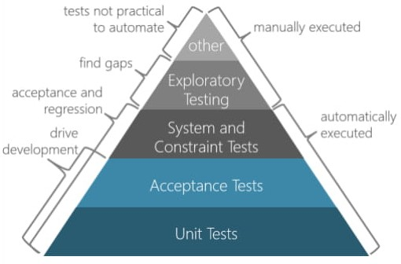
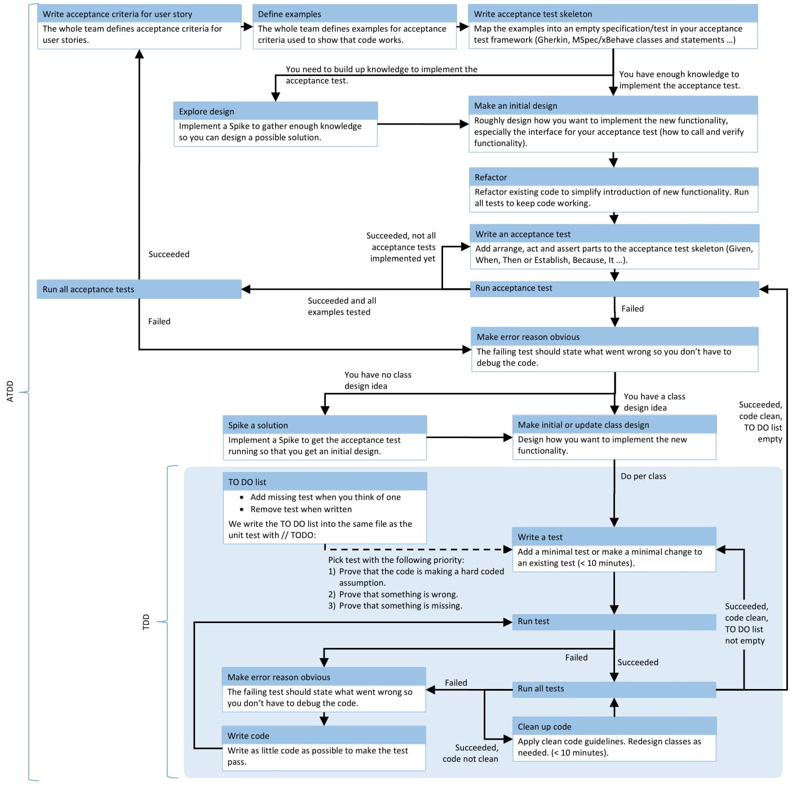

Uncle Bob’s clean Architecture

Separation of concerns

Entities layer reused in multiple applications

Mobile Client Examples

Technical Debt

Test Pyramid

Acceptance Test-Driven Development

ATDD Cycle

ATDD Process

